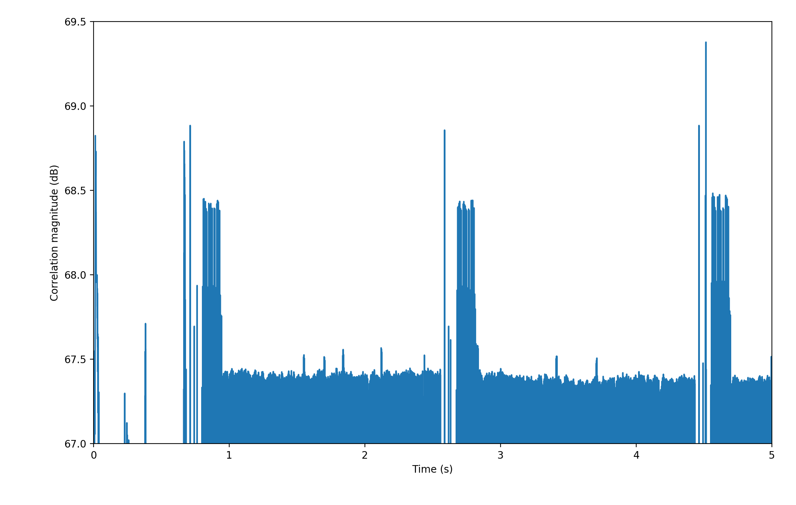

## Objectives

In this section, you will use some recorded frames from the [FLEX](http://en.wikipedia.org/wiki/FLEX_(protocol)) pager network and locate the frame synchronization word. The sync word allows the decoder to synchronize with the beginning of the message bits. A standard method for detecting the sync word is to correlate the incoming signal against the sync word.

Review the theory on [Frame Synchronization](({{site.baseurl}}/_docs/FrameSync.pdf). Further description of frame synchronization is in the text *CR Johnson, WA Sethares, Software Receiver Design, Cambridge, 2011* chapter 8, section 8.5.

You will be provided with a data file from which you will extract information on the sync words.

---

## Part 3 Deliverables

- The code written to find sync words in a provided file.

- There are 2 questions in this part. They is clearly indicated.

---

## Finding synchronization bits

### Previewing the data

There is a relatively strong (if you are near Victoria) FLEX pager network signal around 929.66 MHz. The FLEX signal is multi-level Frequency Shift Keying, so an FM demodulator is needed to extract the data.

Although FLEX can use a variety of modulation schemes, the sync word (marker) is always sent as 2-level FSK at 1600 bits per second.

Download [this data file]({{site.baseurl}}/_ece350/lab4/data/FLEX_bits.wav). It is already demodulated for you.

Create a new flowgraph, and use a *WAV File Source* along with a *QT GUI Time Sink* to view the demodulated FSK. You should now see what looks like a digital waveform as shown.



   
  __*Demodulated FLEX signal*__

In the above snapshot of the waveform, the data bits can be visually observed as `00111101101101010100100100`.

### Bit and Frame Sync

To find the locations of the sync words in a data waveform like this requires two steps:

1. find the sync word
2. find where in the bit stream the sync word occurs

In this portion of the lab you are provided with the sync word (it is the 32-bit sequence `1010 0110 1100 0110 1010 1010 1010 1010`) and you must find a way to get the times of at which it occurs.

You are not going to be provided with a detailed walkthrough of how to obtain the deliverables, but what follows is a list of valuable insights and suggested directions.

It can be helpful to visually examine the file. Two ways of doing this are to:

1. Open it in Audacity. Once loaded into Audacity, it is easy to zoom in and look around the waveform for the sync words
1. Open it in GNU Radio. When using a *GNU Radio Time Sink* you can set the number of points that are plotted and then tell the *WAV File Source* to *not* repeat the signal. So if you tell the sink to plot the entire file at once you can then zoom in and look around the waveform that way.

To determine a bitstream programatically requires a bit more thought. In this case, since the USRP is phase-locked to a GPS-timed 10 MHz source, there is an integer number of samples per bit, which makes the waveform-to-bits conversion much easier.

One method to find the locations of the sync word by programatically is to correlate the entire bitstream with the known sync word. It can be done as follows:

1. Visually examine the file either in Audacity or GNU Radio (or Matlab is another option) to determine the location of the first sync word. The sync word you should look for in this case is the 32-bit sequence: `1010 0110 1100 0110 1010 1010 1010 1010`.

2. Now you must create a stand-alone sync word. This can be done:

  - using Audacity, you can copy and paste that portion of the WAV file into a new file that contains only the sync word. Now you have two WAV files: one with the entire bit stream, and one with only the sync word.
  - using a programming language of your choice (Python, Matlab, whatever you like), create an array that contains the sync word.

   

3. Now the isolated sync word needs to be correlated against the entire bitstream. This will need to be done using the programming language of your choice. The following list are useful links on correlating using matlab or python:
     - Matlab: [xcorr](https://www.mathworks.com/help/matlab/ref/xcorr.html)
     - Python:
       - [np.correlate (slow)](https://docs.scipy.org/doc/numpy/reference/generated/numpy.correlate.html)
       - [scipy.signal.fftconvolve (fast)](https://docs.scipy.org/doc/scipy/reference/generated/scipy.signal.fftconvolve.html)

The entire script required to make the sync word, do the correlation, and plot it can be done in less than 10 lines of code. Don't overthink it!

When you plot the correlation, you should see something like the following image.

   
  __*Correlation between sync word and data stream*__

  

You can now visually count the number of sync words by looking at the correlation, and find the spacing between them. If you prefer, this can also be done programatically using peak finding functions like:

- Matlab: [findpeaks](https://www.mathworks.com/help/signal/ref/findpeaks.html)
- Python: [scipy.signal.find_peaks](https://docs.scipy.org/doc/scipy/reference/generated/scipy.signal.find_peaks.html)





## Decoding text

As an additional challenge (this is not a deliverable), try to decode some text. The letters and numbers are not encrypted. Some hints may be found [here](http://scholar.lib.vt.edu/theses/available/etd-10597-161936/unrestricted/THESIS.PDF), on pages 4-11.



---

## Deliverables

From this part of the lab keep the following files to submit to your TA after the lab:

- the code written to find the sync words,

- the answers to two deliverable questions.
