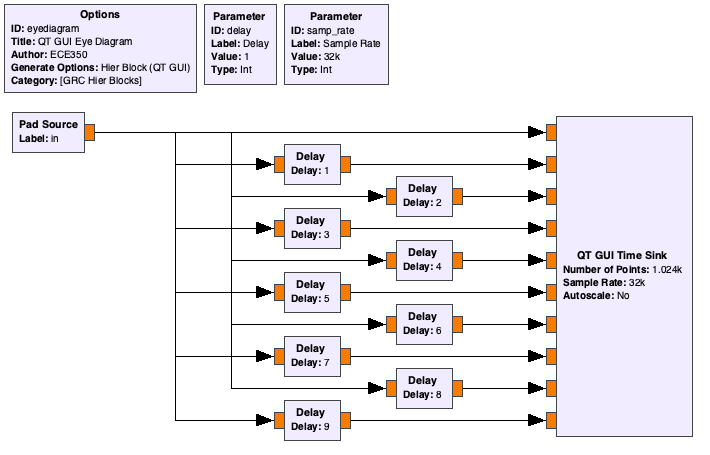
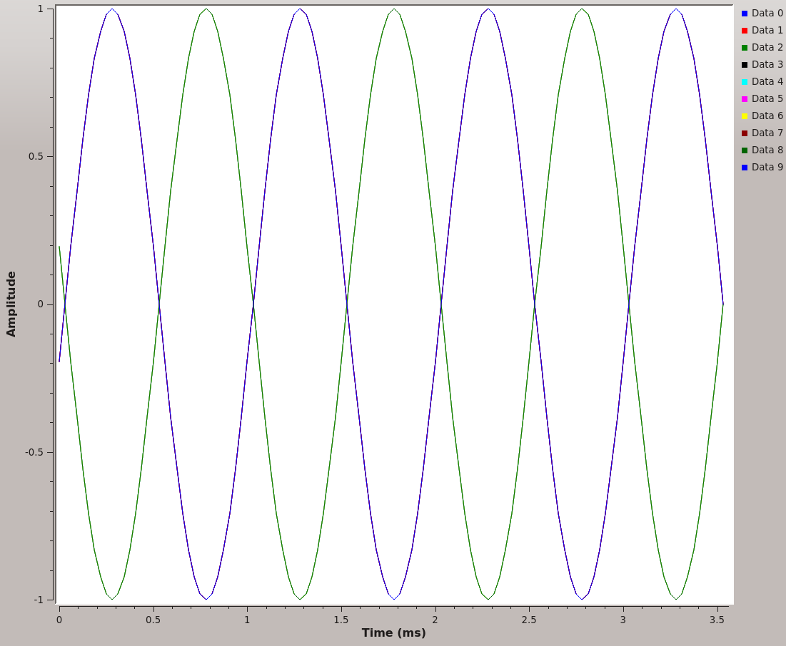
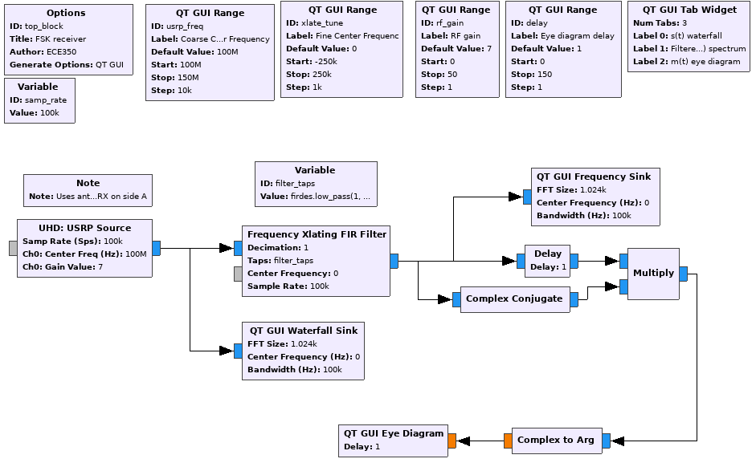
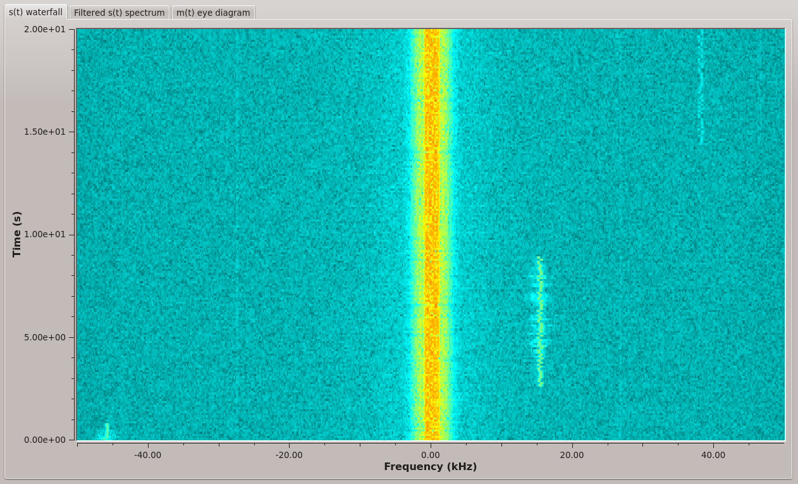
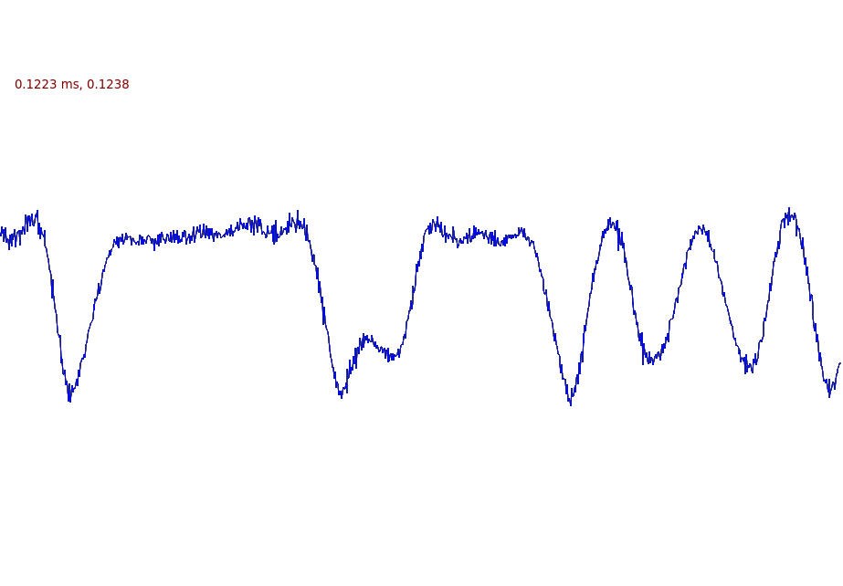
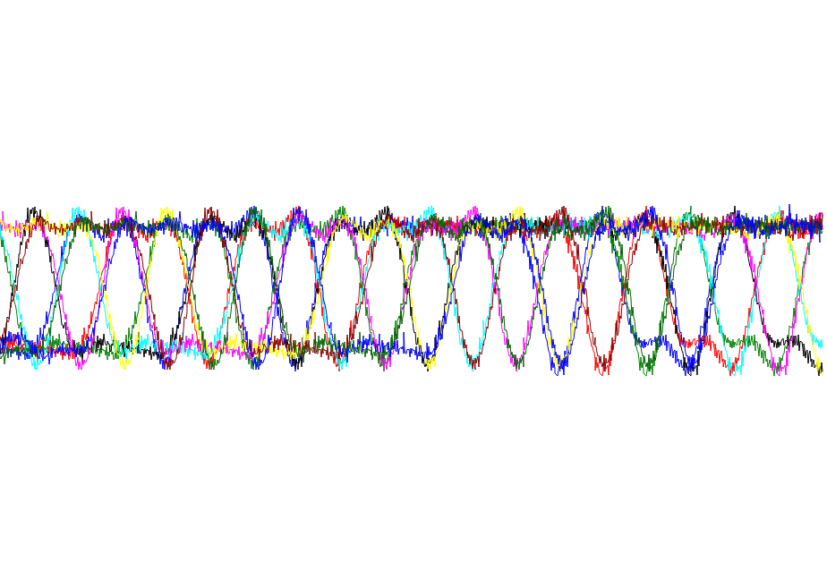

[**Back to introduction**](introduction.md) | [**Begin Part 2**](PSK-pulse-shaping.md)

## Objectives

This part of the lab is a guide to measuring bit rates of real FSK signals. In it you will:

- learn about GNU Radio Heirarchal blocks

- use the flowgraph constructed during the past lab to demodulate an FSK signal and measure its bit rate

---

## Part 1 Deliverables

- There are 3 questions in this part. They are clearly indicated.
  - The question requires approximately 1 line of writing, and will generally address a concept. Answer the question and submit a single page containing the answers to your TA at the end of the lab.

---

## Eye diagrams in GNU Radio

### Compiling a QT GUI eye diagram heirarchal block

- Download and open [this grc file](./data/heir-eyediagram.grc).
  - Notice that instead of *Variable* blocks, there are *Parameter* blocks and the flowgraph is fed by a *Pad Source* block.

   
  __*Flowgraph of the heirarchal eye diagram block*__

- The *Pad Source* will be fed a time series of floats which it will then delay by multiples of a parameter-set variable.
  
- Try to execute this flowgraph. Nothing happens because this has been designed to be a _Heirarchal_ block. Heirarchal blocks can be compiled into a block which becomes available for your other GRC flowgraphs.

- Open the *Options* block and check that the *Generate Options* parameter is set to *Hier Block (QT GUI)*.
  - The *Category* parameter controls where it can be found in the GRC search panel. This means that when compiled, your block will be available in the category called "GRC Hier Blocks".
  
- Generate the flowgraph using the  button, instead of executing it.

- Open a new flowgraph, add a *Signal Source* of type *Float* and connect it to a *Throttle* block.
  - Set the *Waveform* parameter to either "Cosine" or "Sine".

- Now look for your newly built heirarchal block. If it is not there, you can reload the block structure with the .

- Add a *QT GUI Range* block to control the delay of the *QT GUI Eye Diagram* block.
  - Set the *Type* to "Int"
  - Give it a default value of 1, a minimum of 0 and a maximum of 50
  - Call the variable `delay`
  - Set the *Delay* parameter of the *QT GUI Eye Diagram* block using this variable
  
- Execute the flowgraph, now change the delay until a clear eye diagram is visible. It should look like the following figure when you are at a delay of 16 samples.

   
  __*Eye diagram for a 1 kHz sine wave*__

- You can click on the data labels ("Data 0", "Data 1", etc) to enable and disable different streams. Remember that each stream is just a delayed version of the input. As you disable streams you will see the redundancy in some of them.
  >Because this is a sine wave with a bit message of `101010...`, you will get a perfect eye diagram with only two streams (one delayed).

---

#### Deliverable Question 1

At what sample delay does this occur and how does this delay relate to the sampling rate?

---

#### Deliverable Question 2

What is the bitrate of this source? How does this relate to the message frequency?

---

- This flowgraph is not a deliverable.

### A real-time USRP-received FSK signal

- Download and open [this GRC file](./data/Incomplete-FSK-receiver.grc). It is very similar to the one you built in the last lab.

- Add a *QT GUI Eye Diagram* block.
  - Use the included `delay` variable for the block's delay parameter
  - It should look like the following figure

   
  __*GRC file of FSK demodulation being fed into a user-controlled eye diagram*__

- Execute the flowgraph and tune to the 2-level FSK signal at 142.17 MHz. This signal is the control channel for the [CREST public safety radio system](http://www.crest.ca/).

  > The bandwidth of this signal is about 25 kHz compared to the 200 kHz for FM broadcast signals.

  - In the waterfall plot, the CREST signal should be fairly strong as in the figure below.

   
  __*Waterfall of CREST FSK*__

- Now go to the eye diagram and set the delay to 0. It should look like the following figure.
  - By setting the delay to 0, you have perfectly overlapped all 10 streams.

   
  __*Demodulated CREST FSK*__

- Now change the delay until the eye diagram becomes clear. It may help to increase the *RF Gain* parameter.

   
  __*Eye diagram of CREST FSK signal*__

---

#### Deliverable Question 3

What is the bit rate of the control channel for the CREST public safety radio system in bits-per-second?

> Hint: look at the time between the symbols.

---

## Deliverables

From this lab part, keep the following for later submission to your TA:

- The answers to [Question 1](#deliverable-question-1), [Question 2](#deliverable-question-2), and [Question 3](#deliverable-question-3).

---

[**Back to introduction**](introduction.md) | [**Begin Part 2**](PSK-pulse-shaping.md)
