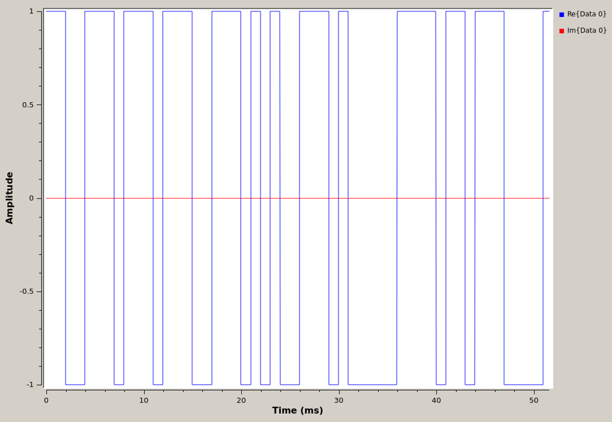
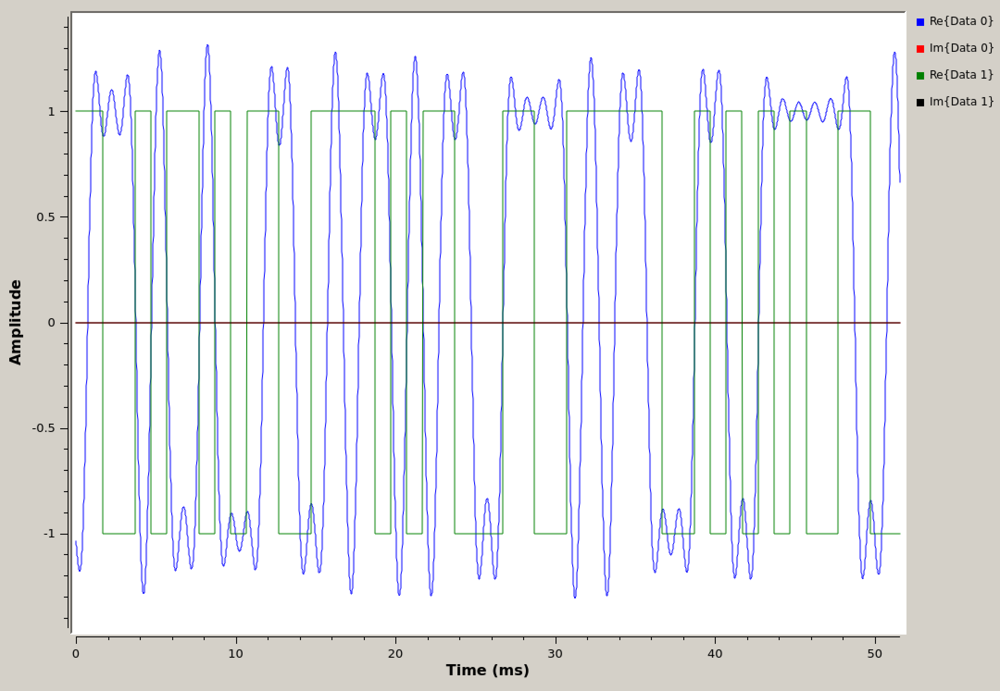
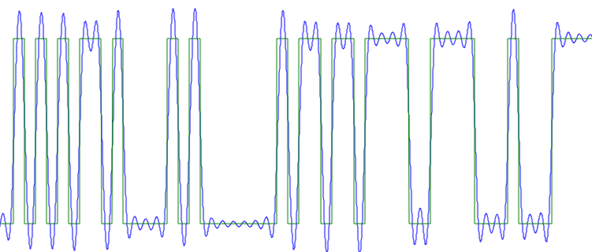
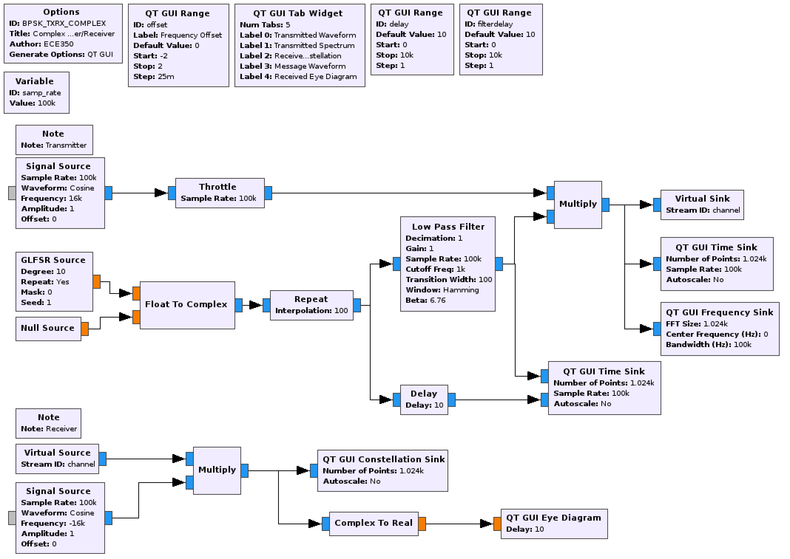
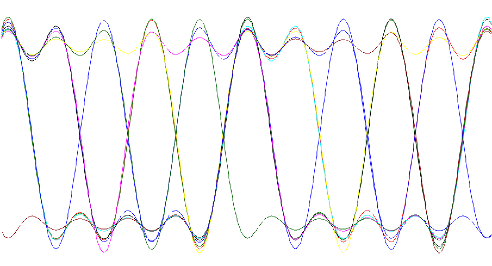
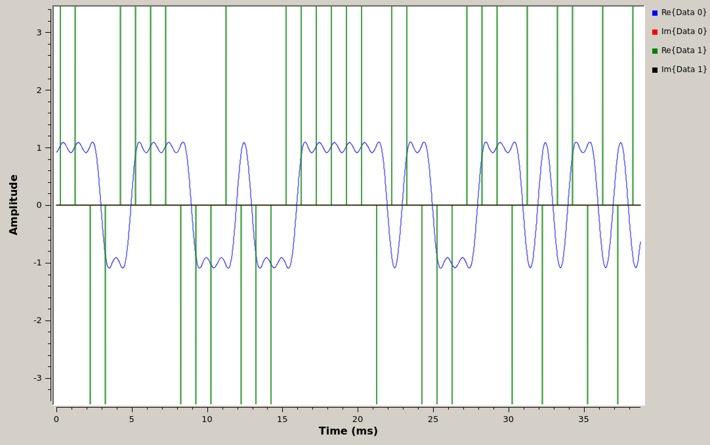
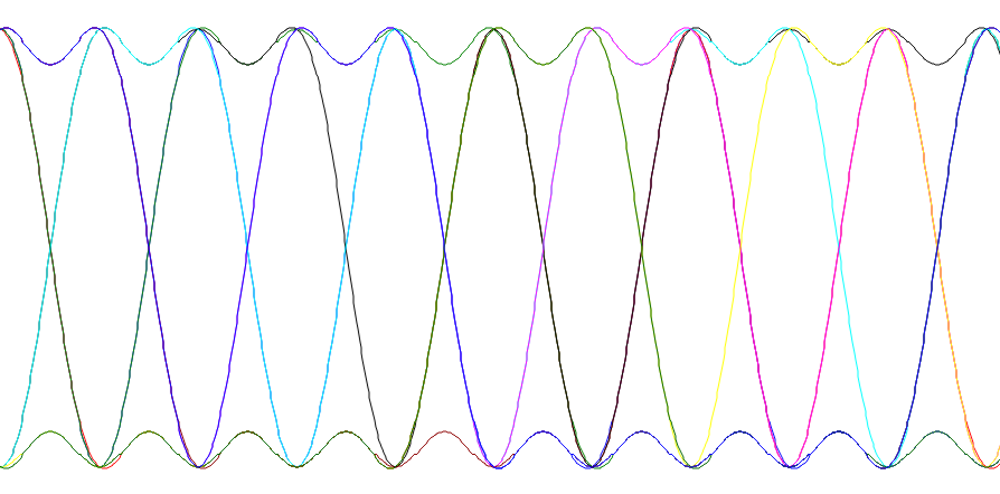
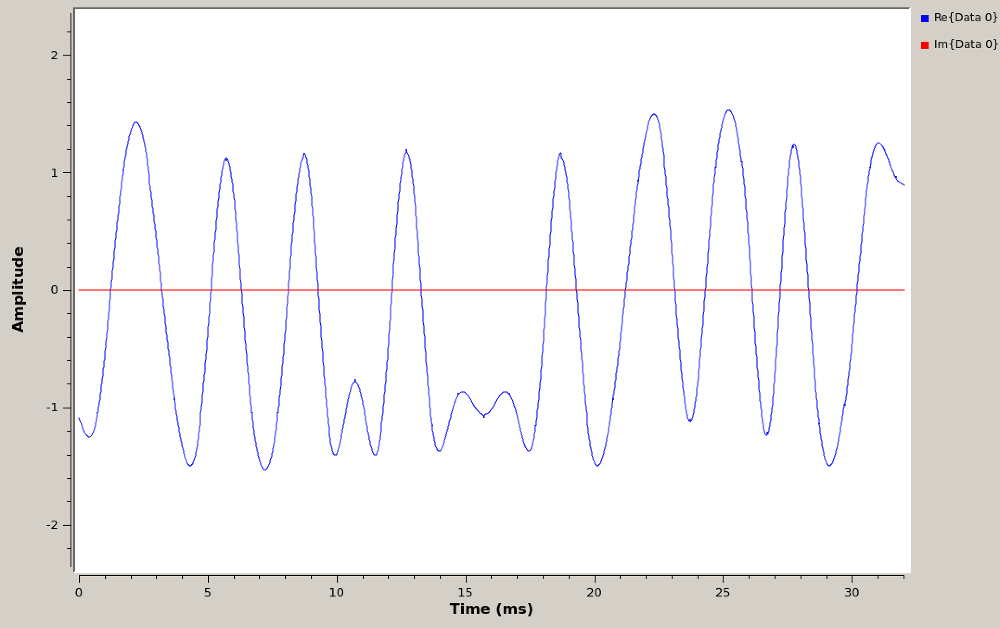
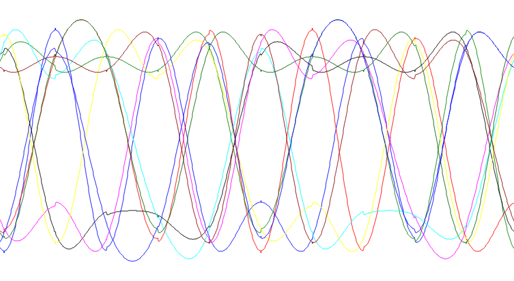

## Objectives

In this section, we modify a complete PSK transmitter-receiver system assuming a perfect channel and perfect synchronization (timing).

Start by reviewing the theory in the text chapters 6 (pulse shaping) and 7 (PSK).

---

## Part 2 Deliverables

- There is 1 question in this part. It is clearly indicated.
  - The question requires approximately 1 line of writing, and will generally address a concept. Answer the question and submit a single page containing the answers to your TA at the end of the lab.

---

## Building a pulse-shaped PSK system

The following GRC flowgraphs will help you understand how BPSK and QPSK are generated:

- Complex BPSK: [bpsk_txrx_complex.grc](./data/bpsk_txrx_complex.grc)

- Complex QPSK: [qpsk_txrx_complex.grc](./data/qpsk_txrx_complex.grc)

Observe that for each of these flowgraphs, the signal source is a square wave (not an impulse train) representing a `1010...` data pattern represented at the given sample rate.

- **What is the bit rate and the symbol rate in each case?**
- **How many samples per symbol?**

Observe how the signal constellation rotates when the frequency offset is not equal to zero.

### Modifying the PSK system to have a pseudo-random source

We now modify the Complex BPSK flowgraph to use a random data pattern.

Replace the message signal source with a random data pattern generated using a Galois linear feedback shift register (*GLFSR Source*).

- Set the *Degree* parameter to 10.
- Connect the output of the *GLFSR Source* block to one of the inputs of the *Float To Complex* block.

Connect a *Null Source* block to the other input of the *Float To Complex* block.

The *GLFSR Source* outputs one sample per bit. Add a *Repeat* block after the *Float To Complex* conversion so that each data bit generates a square pulse. The original message sinusoid was operating at 500 Hz; equivalent to 1000 bits-per-second. Considering the sampling rate of 100 kHz, it follows that the *Repeat* block should be set to output 100 bits for every bit received from the *GLFSR Source*.

Add a *QT GUI Time Sink* at the output of the *Repeat* block to observe the square pulses.

- You can also add a *QT GUI Eye Diagram* block to see the eye diagram of the message.

   
  __*Time domain of GLFSR generated pseudo-random square waveform*__

### Using a low pass filter to shape square pulses

In this section, we filter square pulses using a low-pass filter. For reference, see section 6.4.3 of [the textbook](../../_docs/pdriessen_textbook.pdf).

Add a *Low Pass Filter* to shape the square pulses into more rounded pulses.

- Use a *Cutoff Frequency* of 1000 Hz and a *Transition Width* of 100 Hz. **Why were these numbers selected? Can you improve upon them?**

Add a *QT GUI Time Sink* at the output of the *Low Pass Filter* to observe the transmitted rounded pulses.

Set the scope to have 2 inputs and pass in one from before and one from after the *Low Pass Filter*. You can now see the shaped pulses overlapping the input square pulses.

   
  __*Time domain of square wave and pulse shaped square wave*__

Notice the delay between the original signal and the pulse-shaped signal. This delay is caused by the filter. Check how many samples it is delayed by.

- Add a *Delay* block between the *Repeat* block and the *QT GUI Time Sink*.
- Control it with a *QT GUI Range* block

In this instance, a delay of 1200 samples yields a perfectly overlapped signal with no delay as in the following figure.

   
  __*Time domain of square wave and pulse shaped square wave with the delay removed*__

The flowgraph should look like the following figure.

   
  __*Flowgraph to pulse-shape square waves using a low pass filter*__



Add a *QT GUI Eye Diagram* at the output of the receiver to observe the received eye diagram. Observe how the received eye diagram changes as the frequency offset is changed from zero. Explain your observations.

- You will need a *Complex To Real* block between the receiver output and the *QT GUI Eye Diagram* block.
- Knowing the sample rate and the message frequency, set the *Delay* parameter to be 500. **Why is 500 used here?**

   
  __*Eye diagram of LPF shaped square waveform*__

### Using a low pass filter to shape impulses

In the following steps, we create the pulse shape using impulse inputs instead of square wave inputs. At first they will still be shaped using a low-pass filter. For reference, [text section 6.4.4](../../_docs/pdriessen_textbook.pdf) covers this material.

Replace the *Repeat* block with an *Interpolating FIR Filter*.

- As in the *Repeat* block, keep the interpolation factor at 100.
- Set the number of taps to 100.

The output of the *Interpolating FIR Filter* is fed into the same *Low Pass Filter*.

- Change the *Cutoff Frequency* to be 500 Hz and the *Transition Width* to be 1000 Hz.

Again visualize both the input to the LPF and the output using the same time scope.

   
  __*Time domain of impulses and LPF shaped impulses*__

To line up the input and output of the filter, a delay of 120 samples will result in a plot like the following figure.

   
  __*Time domain of impulses and LPF shaped impulses with the delay removed*__

Observe the eye diagram of the receiver output. Again, change the frequency offset and study it's effect on the eye diagram.

   
  __*Eye diagram of LPF shaped impulses*__

### Using a Root-Raised Cosine frequency domain filter to shape impulses

Continuing to use impulses for the input, we will now use a *Root Raised Cosine Filter* whose coefficients (taps) exactly represent the desired pulse shape. This is covered in [the text](../../_docs/pdriessen_textbook.pdf) section 6.4.5 and 6.4.6.

Replace the *Interpolating FIR Filter* and *Low Pass Filter* blocks with a *Root Raised Cosine Filter* of type "Complex->Complex (Interpolating)".

- The input to the RRC filter is at the symbol rate (one sample per bit).
- The interpolation factor should be the same as it was with the *Repeat* and *Interpolating FIR Filter* blocks.
- The *Symbol Rate* is symbol rate in Hz after interpolation
  > Remember, $$ f_m = 500 Hz $$ and $$ f_m = \frac{1}{2T} $$. For a cosine wave two bits are transmitted during each period, a 1 and a -1.
- The number of taps can be set to 600.
- Set the *Gain* value to be 100.

Notice that the interpolation has been combined with the filtering. The input to the *Root Raised Cosine Filter* has a different samples-per-symbol rate than the output, and so plotting them both together doesn't make sense.

- Change the *QT GUI Time Sink* to only have one input and connect it to the output of the filter.

   
  __*Time domain of impulses and RRC shaped impulses*__

Use an eye diagram at the output of the receiver to confirm the symbol rate you calculated above.

   
  __*Eye diagram of RRC shaped impulses*__

---

## Deliverables

From this part of the lab keep the following files to submit to your TA when you have completed the lab:

- The answer to one deliverable question.
