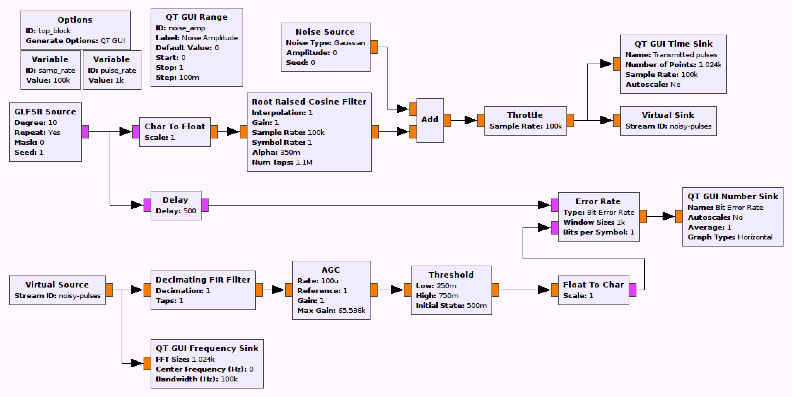

## Objectives

You will implement a communications system using a Root Raised Cosine (RRC) filter for pulse shaping.

---

## Part 3 deliverables

For this section, the deliverables are:

- the answers to two deliverable questions,
- a dataset for later use in this lab.

---

## RRC pulse shaping

Construct the following GRC flowgraph. It is very similar to the previous pulse shaping flowgraphs. You can "File>Save As" in GRC in order to not begin from scratch again.

  
  __*Blank RRC pulse shaping flowgraph*__

- The receiver chain is unchanged from the LPF version.

- The tranmitter chain is now pulse shaping with a *Root Raised Cosine Filter* block.
  - The filter is of type "Float->Float (Interpolating)".
  - The filter roll-off factor ($$\alpha$$) indirectly specifies the bandwidth of the filter. Set $$\alpha=0.35$$.
  - An ideal RRC filter has an infinite number of taps but in practice must be windowed. Set the number of taps to the sampling rate.
  - The symbol rate is the pulse rate (considering we're operating a random source with one bit per symbol).
  - The interpolation factor is the same as for the previous pulse-shaping methods (and for all pulse shaping methods it is the number of samples per pulse when coming from a bit stream to a waveform).
  - The gain can be found in the same way as with the LPF pulse shaping. Measure the amplitude and set the gain such that the shaped pulses are 1 or 0.

- The delay can be found as before. It is 500 samples with the above listed filter parameters.

- Now collect a dataset of SNR and BER at noise amplitudes of 0.0, 0.1, 0.2, ... 0.9, 1.0.
  - The Bit Error Rate can be read off of the *QT GUI Number Sink* output. After changing the noise amplitude, let the BER stabilize before recording it.
  - To read the SNR, activate the "Control Panel" option in the *QT GUI Frequency Sink* block parameters. Then, while the flowgraph is running, set "Trace Options" to "Max Hold" and make sure the "Avg" slider is set to maximum. This should make it easier to read the signal SNR off of the generated spectrum.
  - As you record these values, observe the transmitted noisy pulses and the spectrum. How does the spectral shape compare with the LPF version?

- Change the noise amplitude back to 0 and offset the delay value by 1.





Review the [section deliverables](#part-3-deliverables) beforing moving on.
