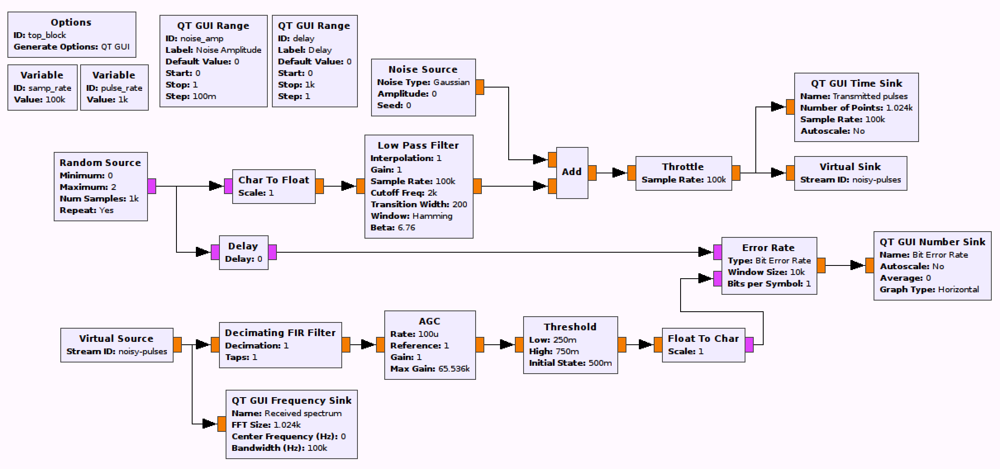

## Objectives

You will implement a communications system using a Low Pass Filter (LPF) for pulse shaping. 

---

## Part 3 deliverables

TBD

---

## LPF pulse shaping

Construct the following GRC flowgraph. It is very similar to the square pulse shaped flowgraph but the interpolation mothod has changed. You can "File>Save As" in GRC in order to not begin from scratch again.

    
  __*Blank LPF pulse shaping flowgraph*__
  
- For the transmitting stream, the *Low Pass Filter* has a series of parameters that need adjusting. We can use this block to first interpolate the bit stream and then filter it.
  - The "FIR Type" should be "Float->Float (Interpolating)",
  - the interpolation factor is the same function of sampling rate and pulse rate as before,
  - the cutoff frequency has to capture the message frequency, so setting it to twice the pulse rate (`pulse_rate*2`) provides some wiggle room in the filter passband.

- For the receiving stream, the *Decimating FIR Filter* decimates the waveform back to the bitstream. Set the "Decimation" parameter accordingly. Because the block fails to compile without a taps argument, set "Taps" to 1 (meaning there is 1 tap and it's value is 1. This has no impact on the waveform). The Automatic Gain Controller (AGC) that follows the decimator uses default parameters. It adjusts the amplitude of the input to be close to the reference (in the default, 1).

- Test the system by running it. Observe the time sink connected to the end of the receiver chain (below). Notice that the waveform amplitude is very low at the output of the filter. Find the amplitude of the pulse peaks and then change the "Gain" parameter in the *Low Pass Filter* block such that the waveform pulses peak at 1.

      
    __*Output of LPF before gain is applied.*__

      
    __*Output of LPF with the appropriate gain applied.*__

- Using the same method as in the [previous section of the lab](), find the system delay and apply it. Again, it will differ by computer but mine was around 6.

- Record the BER values for noise amplitudes of 0, 0.25, 0.5, 0.75 and 1.


