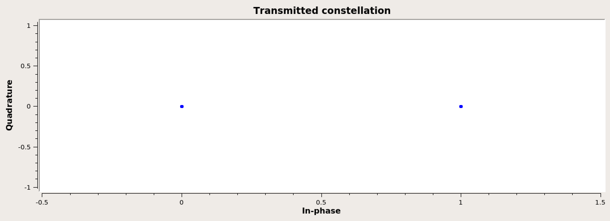

## Objectives

You will implement a communications system using baseband BPSK and record data to later generate a BER curve with.

---

## Part 3 deliverables

For this section, the deliverables are:

- two datasets for later use in this lab.

---

## Build bipolar flowgraph

Edit the GRC flowgraph from the last part of the lab. Remove the histogram and constellation sink blocks as well as the *QT GUI Range* block. Add a variable block. Set the *ID* of the variable to `sigma`.

Remember that the *Amplitude* parameter of the *Noise Source* block sets the noise standard deviation, $$\sigma$$, and that the noise power of pure White Gaussian noise is the variance of the distribution ($$\sigma^2$$) (text section 3.1.3.4). Also recall from the [theory section]({{ site.baseurl }}) that $$P_B=Q\left( \frac{a_1 - a_2}{2\sigma_0} \right)$$. Set the amplitude parameter to the new variable, `sigma`.

The bipolar bits $$a_1$$ and $$a_2$$ are fixed at -1 and 1 by the *Char to Float* and *Add Const* blocks. You will vary $$\sigma$$ and measure $$P_B$$ (which is the output of the *BER* block).

## Collect bipolar BER values

1. Run the flowgraph.
<!-- 2. Record a BER value for each `sigma`  in `[0.3, 0.35, 0.4, 0.45, 0.5, 0.6, 0.75, 1, 1.5, 3, 100]` (**notice that the step size between the values changes**). -->
2. Record a BER value for each `sigma`  in `[ 0.3, 0.5, 1, 1.5, 2, 3, 4, 5, 8, 12]` (**notice that the step size between the values changes**).



## Build unipolar flowgraph

Edit the flowgraph once more by removing the *Add Const* block and setting the *Scale* of the *Char to Float* block to 1.

This is now a unipolar system. You may wish to add a constellation sink briefly to check that this is true (as below).

   
  __*Constellation plot of the unipolar system with no noise added*__

The unipolar bits $$a_1$$ and $$a_2$$ are now 0 and 1.

## Collect unipolar BER values

1. Run the flowgraph.
<!-- 2. Record a BER value for each `sigma`  in `[0.3, 0.35, 0.4, 0.45, 0.5, 0.6, 0.75, 1, 1.5, 3, 100]` (**notice that the step size between the values changes**). -->
2. Record a BER value for each `sigma`  in `[ 0.3, 0.5, 1, 1.5, 2, 3, 4, 5, 8, 12]` (**notice that the step size between the values changes**).

Review the [section deliverables](#part-3-deliverables) before moving on.
