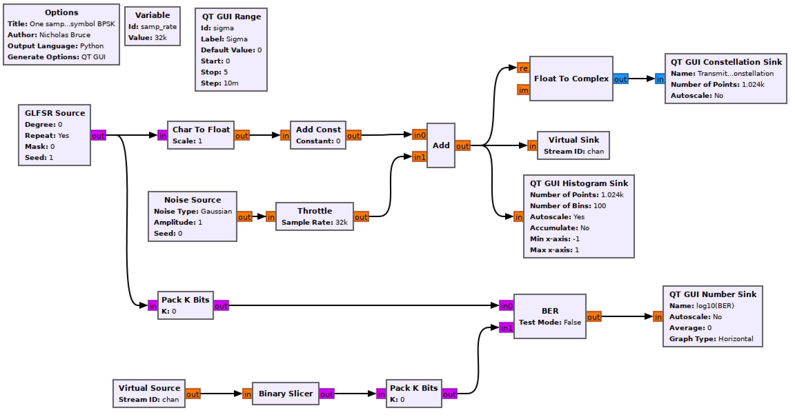

## Objectives

You will implement a communications system using baseband BPSK and generate a histogram to visualize bit errors.

---

## Part 2 deliverables

For this section, the deliverables are:

- the answer to one deliverable question,
- a dataset for later use in this lab.

---

## Building the flowgraph

Construct the following GRC flowgraph.

   
  __*Blank one sample per symbol BPSK flowgraph*__

### GLFSR Source

This block outputs a pseudo-random bit stream using a shift register as described in the [theory section]({{ site.baseurl }}). Set the Degree of the shift register to 20 (this is the LFSR's $$M$$ value). Set it to repeat.

### Char To Float & Add Const

The output of the GLFSR block is a series of 1's and 0's. In order to build a bipolar BPSK system the 0s must become -1s. This can be done using the following equation

$$
y[n] = 2x[n]-1
$$

where $$y[n]$$ is the output stream made up of -1s and 1s and $$x[n]$$ is the input stream of 0s and 1s.

Setting the *Scale* parameter of the *Char To Float* block to 0.5 and the *Constant* parameter of the *Add Const* block to -1. You can observe the output of the *Add Const* block using a *QT GUI Constellation Sink* to see that this is now a BPSK signal.

### Noise Source

The *Amplitude* variable sets the noise standard deviation, $$\sigma$$. The noise power of pure White Gaussian noise is the variance of the distribution ($$\sigma^2$$) (text section 3.1.3.4). This means you can directly control the noise power by setting this value.

Set the noise *Amplitude* to `sigma`.

### QT GUI Range

This will be used to control the noise power added to the bitstream. Ensure it is labelled appropriately and the __*id*__ is `sigma`. The values should range from 0 (default) to 1 in small increments (use your discretion, and remember you can always change it later).

### Throttle

When there is no hardware block in a flowgraph (SDR, file reading/writing, network interface) the CPU will run the flowgraph as fast as it can. A throttle block should only be used in the absence of a real rate-limiting block (like here).

### QT GUI Constellation Sink & Float To Complex

To validate that the signal is BPSK and to observe the effect of adding noise to it, view its constellation. The constellation only takes a complex input so convert the input.

### QT GUI Histogram Sink

By viewing the histogram of the noisy bits one can intuitively understand how bit errors occur.

- Increase the *Number of Points* to 4096,
- increase the *Number of Bins* to 1000,
- set the x-axis limits to [-2, 2].

### Virtual Sink & Virtual source

These blocks can be considered as connected by an "invisible" line on the flowgraph. They can be used for more complex tasks, but here they just keep the flowgraph from being criss-crossed with lines. They are also used to simulate a "transmitter" and "receiver". In this case the *Virtual Sink* transmits the noisy baseband waveform while the *Virtual Source* receives it.

Ensure that the *Stream ID* matches between the two.

### Binary Slicer

This block outputs a 0 for every negative input and a 1 for every positive output.

### Pack K Bits

Set *K* to 8. This is the packet byte size that the later *BER* block requires.

### BER

This computes the error between the two inputs. It outputs to log of the BER, so if it outputs a value of -2, the BER is $$10^-2=0.01$$.

Set *Test Mode* to False, which will mean the block immediately starts outputting results (as opposed to waiting for the error rate to stabilize first). While *Test Mode* is False, the other parameters don't do anything, so you can leave them as they are.

### QT GUI Number Sink

This will draw the output of the BER block on a number line. Set the maximum to 0 (since $$10^0=1$$ meaning that every bit is wrong) and the minumum to -7.

## Run the experiment

1. Run the flowgraph.
2. Observe the histogram and constellation plots as you increase the sigma slider from 0 to 1 (which is equivalent to changing the noise power ($$\sigma^2$$) from 0 to 1 as well).
3. Notice that the BER number sink value _increases_ while $$\sigma$$ increases. As the two bits in the histogram overlap, more bit errors occur.
4. Find the $$\sigma$$ value at which point equally between the gaussian distributions (at 0) is completely flat (you can change histogram parameters and the granularity of the *QT GUI Range* widget to help with this). What is the BER at this point?



Review the [section deliverables](#part-2-deliverables) before moving on.
