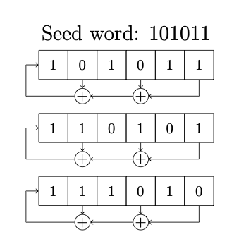
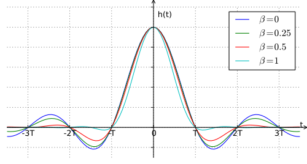
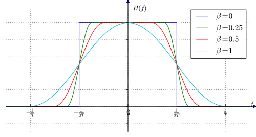

## Pulse shaping

The theory for pulse shaping is covered in the [ECE 350 textbook]({{site.baseurl}}) chapters 6 (pulse-shaping) and 7 (PSK).

## Data source

In order to practice pulse-shaping, it is convenient to have a random data source, with an equal number of logic 1s and 0s, or an equal number of positive and negative pulses. This can be achieved with a so-called linear feedback shift register (LFSR).

    
  __*Linear feedback shift register*__

At each time step (symbol time) $$T$$, the input on the left is determined by the XOR gate output and all the bits slide along one step and the output is the bit on the right. If the feedback shift register is of length $$M$$ and the feedback taps (XOR gates) are selected correctly, the output sequence will have length $$2^M -1$$ before it repeats.

## Implementation in a sampled system

Given a square pulse shape, for a sampling frequency $$f_s$$ and symbol time $$T$$ , there are $$f_sT$$ samples per symbol. Each square pulse contains $$f_sT$$ samples of identical value. The data symbols, $$A_k = \pm 1$$ are represented by one sample per symbol and come from the data source at a rate $$\frac{1}{T}$$ symbols per second. To generate the square pulse, each sample of data must be repeated $$f_sT$$ times, so that the square pulse is represented by $$f_sT$$ samples running at sampling frequency $$f_s$$ to make up a symbol that takes time $$T$$ to transmit. A sequency of these symbols make up a waveform.



### Pulse shaping using a LPF

For the Nyquist criterion to be satisfied, the highest frequency in the datastream is $$\frac{f_s}{2} = \frac{1}{2T}$$. It follows that a square pulse can be low pass filtered at this frequency and retain all of the information in the binary data sequence which will be received/transmitted at that sampling frequency.

### Pulse shaping using a Raised Cosine (RC) filter

The data sequence can be represented by the sequence of impulses $$m_\delta (t) = \sum_k A_k \delta(t-kT) $$. To represent this sequence of impulses, $$m_\delta (t)$$ as a waveform sampled at $$f_s$$, the impulses must be filtered by an interpolating FIR fitler that yields one sample, $$A_k = \pm 1$$ followed by $$f_s T-1$$ samples set to 0.  This sequence can then be shaped by convolving it with a pulse shaping window of impulse response $$p(t)$$ and frequency response $$P(f)$$. _This is the exact operation done when FIR filtering_.

The filter coefficients of the FIR filter will be the pulse shape, $$p(t)$$ sampled at $$f_s$$. $$p(t)$$ can be any shape, for example a square pulse as above ($$p(t)=1$$ for $$0 < t < T $$ and 0 otherwise), but can also be a longer pulse, for example a raised cosine pulse:

$$\begin{eqnarray}
    p(t)=
    \begin{cases}
      \frac{1}{2}\left(1-cos(\pi \frac{t}{T})\right), & \text{if}\ 0 < t < 2T \\
      0, & \text{otherwise}
    \end{cases}
\end{eqnarray}$$

  

The resulting message is written,

 $$\begin{eqnarray}
 m(t) &=& A_0 p(t) + A_1 p(t-T) + A_2 p(t-2T) + \ldots \\
      &=& \sum_k A_k p(t-kT)
 \end{eqnarray}$$

The impulse (left) and frequency (right) responses of an RC filter are below. The impulse response is a sinc shape extending for a time usually truncated to $$6T$$ as shown.

    
  __*Raised cosine impulse (left) and frequency (right) responses for various $$\beta$$ values [(By Krishnavedala - Own work, CC BY-SA 3.0)](https://commons.wikimedia.org/w/index.php?curid=15390895)*__

### Pulse shaping using a Root Raised Cosine (RRC) filter

A receiver is optimum if the receiver filter matches the transmit filter. Thus we often use a Root Raised Cosine (RRC) pulse shaping filter at the transmitter and another RRC filter at the receiver, so that the combination of the two filters yields a Raised Cosine (RC) pulse shape at the receiver output. The RRC filter impulse response looks similar to the RC impulse response but with lower sidelobes.

With a suitable low pass filter or RRC filter, the received data at sampling times $$ t=kT + \epsilon $$ is $$A_k \pm 1$$ (real) where $$\epsilon$$ is adjusted to sample in the middle of the pulse $$p(t)$$. $$\epsilon$$ is a timing offset to sample the data away from the transitions between different bits. This timing offset can be fixed manually. In practical systems, a timing recovery circuit is used to determine the timing offset automatically.

## Theory summary

Pulse shaping can be done in multiple ways. Above, three methods are considered:

1. Generate square pulses and LPF, often used in analog systems,
2. Generate impulses and LPF with time domain an FIR or IIR filter,
3. Generate impulses and filter with a frequency domain RRC filter.
