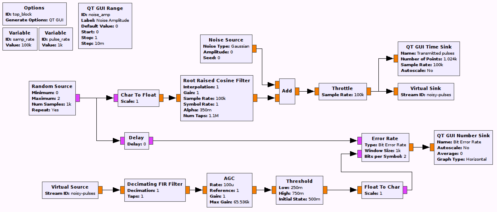

## Objectives

You will implement a communications system using a Root Raised Cosine (RRC) filter for pulse shaping. 

---

## Part 4 deliverables

TBD

---

## RRC pulse shaping

Construct the following GRC flowgraph. It is very similar to the previous pulse shaping flowgraphs. You can "File>Save As" in GRC in order to not begin from scratch again.

    
  __*Blank RRC pulse shaping flowgraph*__
  
- Record the BER values for noise amplitudes of 0, 0.25, 0.5, 0.75 and 1.


