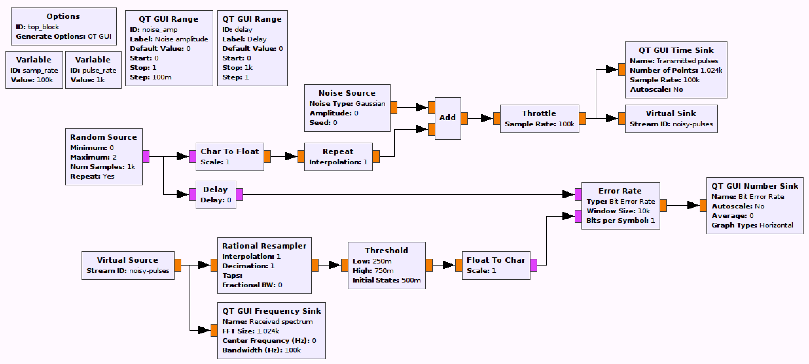
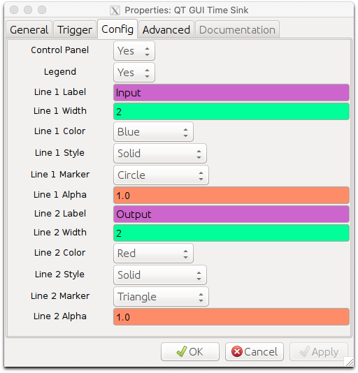

## Objectives

You will implement a communications system using square pulses for the input and a LPF (low pass filter) for pulse shaping.

---

## Part 2 deliverables

For this section, the deliverables are:

- the answer to one deliverable question,
- a dataset for later use in this lab.

---

## Square pulse shaping

Construct the following GRC flowgraph.

    
  __*Blank square pulse shaping flowgraph*__

- The `samp_rate` has been changed to 100 kHz and a `pulse_rate` variable added (at 1 kHz).

- As an input, the *Random Source* block generates a random bit stream of 1000 samples which can be set to repeat (ensure that it repeats). We now desire to shape each of those bits into a square pulse. This is done using the *Repeat* block. Knowing the sampling and pulse rates, pick the appropriate interpolation rate. Notice as well that when the minimum and maximum parameters are 0 and 2 respectively, it means `[0, 2)` so the values output are only ever a 0 or a 1.



- The WGN (White Gaussian Noise) is controlled by a *QT GUI Range* block. The "Amplitude" here indicates the noise standard deviation which be used for calculating the SNR.

- The *Virtual Sink* and *Virtual Source* blocks can be considered an "invisible" line on the flowgraph. They can be used for more complex tasks, but here they just keep the flowgraph from being criss-crossed with lines. They are also used to simulate a "transmitter" and "receiver". In this case the *Virtual Sink* transmits the noisy baseband waveform while the *Virtual Source* receives it.

- The *Rational Resampler* is used to turn the received pulses back into a bitstream. You will need to set the interpolation and decimation rates appropriately (think back to the interpolation factor you chose above for the *Repeat* block).

- The threshold block is used for data detection:
  - When the input signal transitions from below to above the "High" threshold, the output becomes a 1,
  - When the input signal transitions from above to below the "Low" threshold, the output becomes a 0.
  - For our input an intelligent starting place would be to have 0.25 and 0.75 as the threshold bounds, but you should set up two *QT GUI Range* blocks to control these values.

- To evaluate the system performance, we can compute the BER of the system by using the *Error Rate* block. This block compares the two input bit streams. The "Window Size" parameter determines the number of samples used for the BER computation. Use a Window Size of 10000 and set the Bits per Symbol to 1.

- The output of the *Error Rate* block is a percentage (from 0 to 1) so set the limits of the *QT GUI Number Sink* to reflect this.

- Because the "received" bitstream is processed by more blocks before feeding into the *Error Rate* block, a delay must be added to the other input stream. The delay can be found by setting the noise amplitude to 0 and either:
  - storing both streams (using *File Sink* blocks) and correlating them in Matlab or Python,
  - adding a *QT GUI Range* block to control the delay block value then finding the delay value by slowing adjusting the slider. This is what the following instructions explain (you're free to correlate though!).
    - Set the "Type" in the *QT GUI Range* block to "Int" since the delay is in units of samples.
    - Remembering that the random source repeats every 1000 samples, set the "Start" and "Stop" parameters appropriately.
    - Add a *QT GUI Time Sink* with two float inputs: one directly from the random source and one from the output of the threshold block (you will a *Char To Float* block in there too).
    - It is helpful to configure the sink plot so that there are markers. This is helpful considering both inputs are bitstreams, which we want to align.

        
      __*Sink params to make finding the delay grahically a little easier*__

    - When you run the flowgraph you'll likely see an error rate of of between 25 and 50 percent. If you zoom in on the time series plot you'll see that the bitstreams are not aligned. Click "Stop" on the flowgraph so that everything freezes and zoom in (you will want to enable "Control Panel" in the block settings), looking for offset patterns in the two streams. Once an offset has been found (as in the figure below), the delay can be adjusted by the correct number of samples. They delay will vary depending on your computer - it was between 12 and 18 for me.

       
      __*A pattern found in the un-delayed bitstream. The blue bitstream between the blue arrows matches the red bitstream between the red arrows. BER=26%.*__

    - You will know you have the correct delay when your error rate drops to below 6 percent.

       
      __*Delay corrected bitstreams. BER=5%.*__

- Once you have the delay parameter set, you can disable the blocks you used to capture that value.

- Now collect a dataset of SNR and BER at noise amplitudes of 0.0, 0.1, 0.2, ... 0.9, 1.0.
  - The Bit Error Rate can be read off of the *QT GUI Number Sink* output. After changing the noise amplitude, let the BER stabilize before recording it.
  - To read the SNR, activate the "Control Panel" option in the *QT GUI Frequency Sink* block parameters. Then, while the flowgraph is running, set "Trace Options" to "Max Hold" and make sure the "Avg" slider is set to maximum. This should make it easier to read the signal SNR off of the generated spectrum.
  - As you record these values, observe the transmitted noisy pulses and the spectrum. Is the spectral shape what you expected?

- Offset the delay by a single sample. Check the BER with 0 noise amplitude.



Review the [section deliverables](#part-2-deliverables) beforing moving on.
