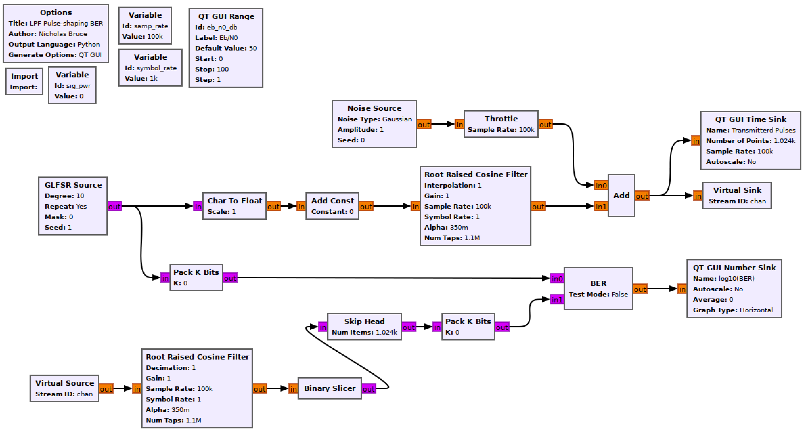

## Objectives

You will implement a communications system using a Root Raised Cosine (RRC) filter for pulse shaping.

---

## Part 3 deliverables

For this section, the deliverables are:

- the answers to three deliverable questions,
- a dataset for later use in this lab.

---

## RRC pulse shaping flowgraph

Construct the following GRC flowgraph. It is very similar to the previous pulse shaping flowgraphs. You can "File>Save As" in GRC in order to not begin from scratch again.

   
  __*Blank RRC pulse shaping flowgraph*__

### Root Raised Cosine Filter (Transmitting)

The tranmitter chain is now pulse shaping with a *Root Raised Cosine Filter* block. Some parameters for the filter are

- the filter is of type "Float->Float (Interpolating)",
- the filter roll-off factor ($$\alpha$$) indirectly specifies the bandwidth of the filter. Set $$\alpha=0.35$$.
- An ideal RRC filter has an infinite number of taps but in practice must be windowed. Set the number of taps to the sampling rate.
- The symbol rate is the same as it was in the last lab section,
- The interpolation factor is the same as for the previous pulse-shaping method (and for all pulse shaping methods it is the number of samples per symbol when coming from a bit stream to a waveform).
- The gain can be found in the same way as with the LPF pulse shaping. Measure the amplitude and set the gain such that the peak of the shaped pulses are at about 1.

### Root Raised Cosine Filter (Receiving)

The receiver chain is now using a matching *Root Raised Cosine Filter* to obtain a final pulse shape that is a raised cosine (review [the theory section]({{ site.baseurl }}) for more on this).

- The filter is of type "Float->Float (Decimating)"
- Set the number of taps to the sampling rate.
- Set the symbol rate and decimation rates appropriately.
- Do not change the gain, by observing the output of the filter you will see that the input symbols (scaled to 1 above) are all either 1 or -1.



### Skip Head

The offset between sequences can be found as before. It is 1000 samples with the above listed filter parameters (which means a 500 sample delay for each component of the matched filter).

### Validate the filter

Ensure that the offset and matched filter are working by setting the *Amplitude* of the *Noise Source* block to 0 and checking that the BER is 0. Once validated, replace the *Amplitude* argument with the expression for $$\sigma$$ derived in the previous section.

### Find the signal power

Use the same method as earlier in this lab to find the signal power at the output of the transmitting RRC filter. Store this value in the `sig_pwr` variable.

## Running the experiment

1. Run the flowgraph. Record the BER at $$\frac{E_b}{N_0}$$ values of 0, 4, 8 dB. It will take some time for the BER values to stabilize. Grab a coffee.
   - *The flowgraph takes time to transition between these values, it is often worth killing the flowgraph after a measurement and starting again with the desired Eb/N0 value as the default.*
   - Plotting the time sink values also eats computational power. While waiting for the BER values to stabilize you may disable the *QT GUI Time Sink* blocks and any other unneeded QT GUI blocks.



2. Add the __*Multiply->Moving Average->QT GUI Number Sink*__ power measuring chain to the output of the receiving RRC filter. Record a power measurement there for:
   - Signal power (set noise power to 0).
   - Noise powers required for Eb/N0 of 0, 2, 4, 6, 8 dB (to do this, set the *Gain* in the Transmitting RRC to 0)
3. Offset the delay (in the *Skip Head* block) by a single sample. Check the BER with no added noise.







Review the [section deliverables](#part-3-deliverables) beforing moving on.
