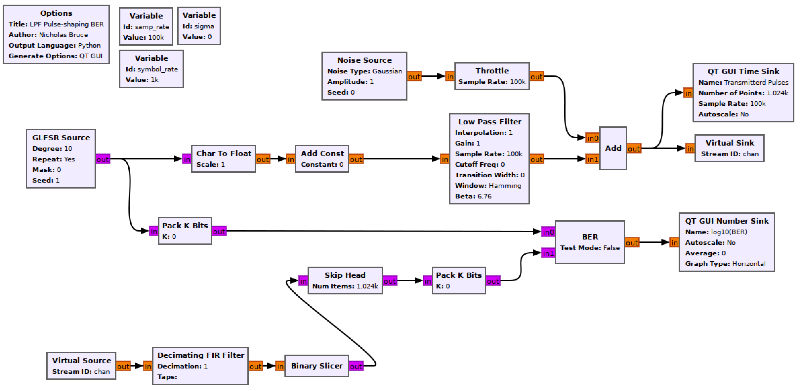
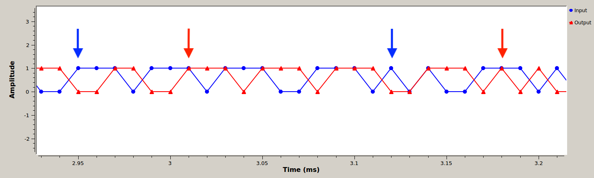
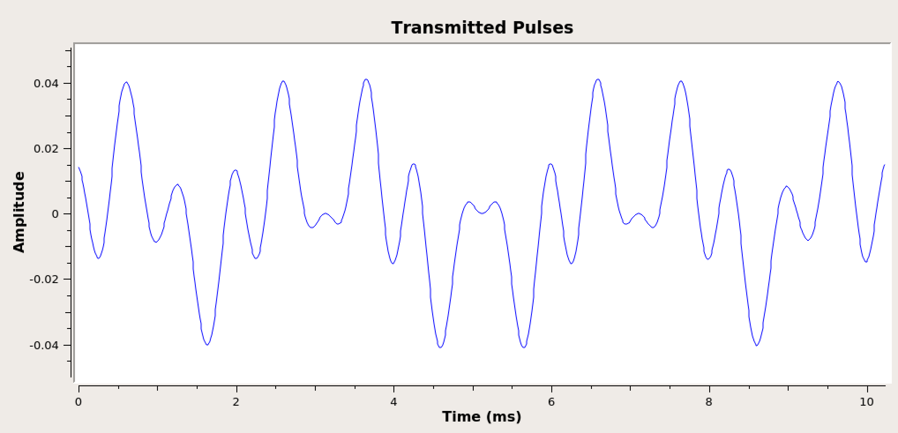

## Objectives

You will implement a communications system using impulses pulses as an input and a LPF (low pass filter) for pulse shaping.

---

## Part 2 deliverables

For this section, the deliverables are:

- the answer to one deliverable question,
- a dataset for later use in this lab.

---

## Building the flowgraph

Construct the following GRC flowgraph.

   
  __*Blank impulse LPF shaping flowgraph*__

### Variables

- The `samp_rate` of this flowgraph is 100 kHz and the `symbol_rate` is 1 kHz.
- Leave the `sigma` variable set to 0.

### GLFSR Source

This block outputs a pseudo-random bit stream using a shift register as described in the [theory section of Lab 1]({{ site.baseurl }}). Set the Degree of the shift register to 10 (this is the LFSR's $$M$$ value). Set it to repeat.

### Char To Float & Add Const

The output of the GLFSR block is a series of 1's and 0's. In order to build a bipolar BPSK system the 0s must become -1s. This can be done using the following equation

$$
y[n] = 2x[n]-1
$$

where $$y[n]$$ is the output stream made up of -1s and 1s and $$x[n]$$ is the input stream of 0s and 1s.

Setting the *Scale* parameter of the *Char To Float* block to 0.5 and the *Constant* parameter of the *Add Const* block to -1. You can observe the output of the *Add Const* block using a *QT GUI Constellation Sink* to see that this is now a BPSK signal.

### Low Pass Filter

The bitstream must be interpolated such that a single impulse happens at the `symbol_rate`. Then these impulses are to be pulse shaped. This can all be done directly in the *Low Pass Filter* block by setting the "Interpolation" parameter appropriately. Knowing the sampling and symbol rates, pick the appropriate interpolation rate.





- A few other LPF parameters need to be adjusted:
  - The "FIR Type" should be "Float->Float (Interpolating)",
  - the cutoff frequency has to capture the message frequency, so setting it to twice the symbol rate (`symbol_rate*2`) will critically sample the message,
  - the transition width to `symbol_rate*0.2`.

### Noise Source

The *Amplitude* variable sets the noise standard deviation, $$\sigma$$. The noise power of pure White Gaussian noise is the variance of the distribution ($$\sigma^2$$) (text section 3.1.3.4). This means you can directly control the noise power by setting this value.

Set the noise *Amplitude* to `sigma`.

### Virtual Sink & Virtual source

These blocks can be considered as connected by an "invisible" line on the flowgraph. They can be used for more complex tasks, but here they just keep the flowgraph from being criss-crossed with lines. They are also used to simulate a "transmitter" and "receiver". In this case the *Virtual Sink* transmits the noisy baseband waveform while the *Virtual Source* receives it.

Ensure that the *Stream ID* matches between the two.

### Decimating FIR Filter

Set the decimation parameter appropriately (think back to the interpolation done in the LPF), remembering to reference the symbol and sample rate variables. The block fails to compile without a taps argument so set *Taps* to 1 (meaning there is 1 tap with a value of 1).



### Binary Slicer

This block outputs a 0 for every negative input and a 1 for every positive output.

### Pack K Bits

Set *K* to 8. This is the packet byte size that the later *BER* block requires.

### BER

This computes the error between the two inputs. It outputs to log of the BER, so if it outputs a value of -2, the BER is $$10^{-2}=0.01$$.

Set *Test Mode* to False, which will mean the block immediately starts outputting results (as opposed to waiting for the error rate to stabilize first). While *Test Mode* is False, the other parameters don't do anything, so you can leave them as they are.

### QT GUI Number Sink

This will draw the output of the BER block on a number line. Set the maximum to 0 (since $$10^0=1$$ meaning that every bit is wrong) and the minumum to -7.

### Skip Head

To compute the BER of the system, the input and output bitstreams must be aligned. The filter causes a delay which can be measured by correlating the bitstreams, or observing them using a *QT GUI Time Sink* as shown in the two figures below.

To do this you can observe the overlapped bitstreams and try to find the offset between them. When the bitstreams are not aligned, the BER rate will be about 50% (this just means both streams are random and equally consist of 1s and 0s).

   
  __*A pattern found in the un-delayed bitstream. The blue bitstream between the blue arrows matches the red bitstream between the red arrows. BER=50%.*__

You will know you have the correct delay when your error rate drops to 0.

   
  __*Delay corrected bitstreams. BER=0%.*__

It is a finicky task to find the correct delay and not the intent of the lab. So, assuming you have correctly set your LPF parameters the *Skip Head* block should have the *Num Items* argument set to 6. This means the first six block inputs are discarded before the input is sent directly to the output.

### Setting LPF Gain

Test the system by running it. Observe the time sink connected to the end of the transmitter chain (below). Notice that the waveform amplitude is very low at the output of the filter. Find the amplitude of the pulse peaks and then change the "Gain" parameter in the *Low Pass Filter* block such that the waveform pulses peak at 1.

   
  __*Output of LPF before gain is applied.*__

   
  __*Output of LPF with the appropriate gain applied.*__

## Run the experiment

1. Run the flowgraph.
2. Record the BER at $$\sigma$$ values of `[0.7, 0.55, 0.44, 0.35, 0.28]`. You will need to kill the flowgraph each time you need to set a new value.
   - Plotting the time sink values also eats computational power. While waiting for the BER values to stabilize you may disable the *QT GUI Time Sink* blocks and any other unneeded QT GUI blocks.
3. Offset the delay (in the *Skip Head* block) by a single sample. Check the BER with no added noise.
4. Measure output powers as described below.
   - As shown in the [theory section]({{ site.baseurl }}), $$SNR_{MAX} = \frac{2E_b}{N_0}$$.
   - The $$SNR_{MAX}$$ is the ratio of the output signal and noise powers. To calculate the $$\frac{E_b}{N_0}$$ value for each above recorded BER value we need to find the output signal power and output noise power.
   - Build the following three blocks to measure the signal power and attach the output of the *Decimating Filter* to both inputs of the multiply block.

      
    __*Flow diagram to measure average power of a data stream.*__

   - The *Length* of the *Moving Average* block is 100000 and the *Scale* is the inverse (ensure that the inverse is a float and not an integer.)

   

   - Disable the *Binary Slicer*, *Skip Head*, both *Pack K Bits* blocks, the *BER* and it's number sink block.
   - Set the *Amplitude* of the *Noise Source* block to 0 so that the signal $$a_i$$ goes throught the LPF and decimation with no noise added before the power is measured.
   - Measure this value and record it.
   - Now measure the noise power by setting the gain of the LPF to 0. Measure and record the noise power at the output of the decimator for `sigma` values of `[0.7, 0.55, 0.44, 0.35, 0.28]`. It takes some time for these numbers to stabilize.

At this point you should have recorded 5 BER values, 5 output noise power values and 1 output signal power value.



Review the [section deliverables](#part-2-deliverables) before moving on.
