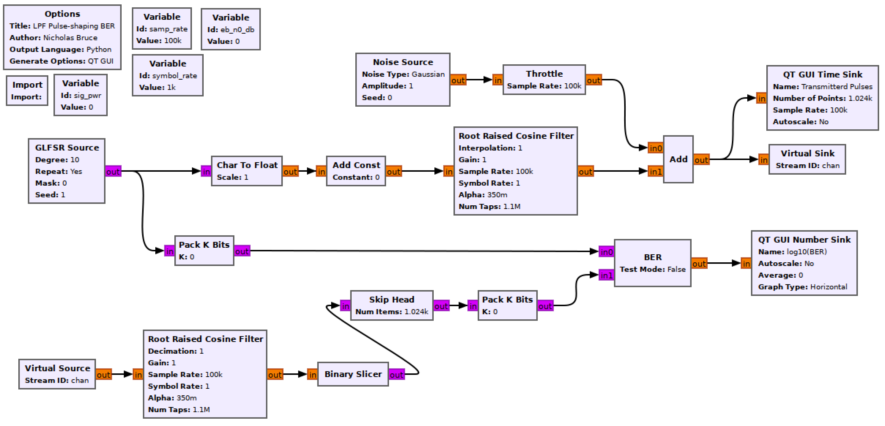
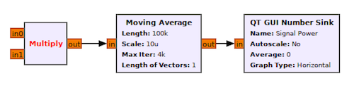

## Objectives

You will implement a communications system using a Root Raised Cosine (RRC) filter for pulse shaping.

---

## Part 3 deliverables

For this section, the deliverables are:

- the answers to two deliverable questions,
- a dataset for later use in this lab.

---

## RRC pulse shaping flowgraph

Construct the following GRC flowgraph. It is very similar to the previous pulse shaping flowgraphs. You can "File>Save As" in GRC in order to not begin from scratch again.

   
  __*Blank RRC pulse shaping flowgraph*__

### Variables

- Replace the `sigma` variable with an `eb_n0_db` variable and set the value to 0.
- Leave the `sig_pwr` variable blank for now.



### Import

The argument is `import math`. This will load the [python math library](https://docs.python.org/3/library/math.html). To call the library functions you would precede them with `math`. For example, to take the square root of the number 5 you would write `math.sqrt(5)` wherever you wanted the result.

### Root Raised Cosine Filter (Transmitting)

The tranmitter chain is now pulse shaping with a *Root Raised Cosine Filter* block. Some parameters for the filter are

- the filter is of type "Float->Float (Interpolating)",
- the filter roll-off factor ($$\alpha$$) indirectly specifies the bandwidth of the filter. Set $$\alpha=0.35$$.
- An ideal RRC filter has an infinite number of taps but in practice must be windowed. Set the number of taps to the sampling rate.
- The symbol rate is the same as it was in the last lab section,
- The interpolation factor is the same as for the previous pulse-shaping method (and for all pulse shaping methods it is the number of samples per symbol when coming from a bit stream to a waveform).
- The gain can be found in the same way as with the LPF pulse shaping. Measure the amplitude and set the gain such that the peak of the shaped pulses are at about 1.

### Root Raised Cosine Filter (Receiving)

The receiver chain is now using a matching *Root Raised Cosine Filter* to obtain a final pulse shape that is a raised cosine (review [the theory section]({{ site.baseurl }}) for more on this).

- The filter is of type "Float->Float (Decimating)"
- Set the number of taps to the sampling rate.
- Set the symbol rate and decimation rates appropriately.
- Do not change the gain, by observing the output of the filter you will see that the input symbols (scaled to 1 above) are all either 1 or -1.





### Skip Head

The offset between sequences can be found as before. It is 1000 samples with the above listed filter parameters (which means a 500 sample delay for each component of the matched filter).

### Validate the filter

Ensure that the offset and matched filter are working by setting the *Amplitude* of the *Noise Source* block to 0 and checking that the BER is 0.

### Finding the signal power

In order to control the simulation, we need to set the `eb_n0_db` variable and have that control the noise power ($$\sigma$$) in the *Noise Source* block. This can be done using the equation you derived in the prelab. In translating the equation into a line of python (so that it can be used in GNU Radio), see that $$f_{SYM}$$ is `symbol_rate` and $$f_s$$ is `samp_rate`.

In this equation, $$a_i^2$$ is the signal power. This is the only parameter still unknown. Build the following three blocks to measure the signal power and attach the output of the transmitting RRC to both inputs of the multiply block.

   
  __*Flow diagram to measure average power of a data stream.*__

The *Length* of the *Moving Average* block is 100000 and the *Scale* is the inverse (ensure that the inverse is a float and not an integer.)



Run the flowgraph and record this power value. Take a second and consider whether the value you have measured is reasonable. The peaks of the RRC output are at about 1 after the gain adjustment above. Save the measured value in the `sig_pwr` variable block.

Now all of the variables in the above derivation for $$\sigma$$ have been found. It is now possible to control the $$\frac{E_b}{N_0} \text{ (dB)}$$ of the system by holding the signal power constant and varying the noise power. Enter the expression for $$\sigma$$ in the *Amplitude* parameter of the *Noise Source* block. It should be a function of `samp_rate`, `symbol_rate`, `sig_pwr`, and `eb_n0_db`.

## Running the experiment

1. Run the flowgraph. Record the BER at $$\frac{E_b}{N_0}$$ values of 0, 2, 4, 6, 8 dB.
   - Plotting the time sink values also eats computational power. You may disable the *QT GUI Time Sink* blocks and any other unneeded QT GUI blocks.
   - __* Ensure that when you change the `eb_n0_db` variable value that the Amplitude of the Noise Source also changes. If sigma is not changing something is wrong (if you're on windows, you might be able to wrap the `eb_n0_db` variable in a `float()` cast. *__
2. Offset the delay (in the *Skip Head* block) by a single sample. Check the BER with no added noise.
3. When discussing an Eb/N0 value, it refers to the *received* energy per bit/noise power ratio. The $$\sigma$$ formula above is true for a matched filter as it relies on the *input* signal power and is true for WGN. What if this simulation was not a MF and not WGN? The standard method of calculating Eb/N0 would be to measure the output signal and noise powers as done in the [previous section]({{ site.baseurl }}) of the lab. Conduct the appropriate measurements to find the Eb/N0 value independent of input signal or noise powers.
   - Add the __*Multiply->Moving Average->QT GUI Number Sink*__ power measuring chain to the output of the receiving RRC filter. Record a power measurement there for:
     - Signal power (set noise power to 0).
     - Noise powers required for Eb/N0 of 0, 2, 4, 6, 8 dB (to do this, set the *Gain* in the Transmitting RRC to 0)



From this section you should have recorded 5 BER values, 5 output noise power values and 1 output signal power value.

Review the [section deliverables](#part-3-deliverables) beforing moving on.
