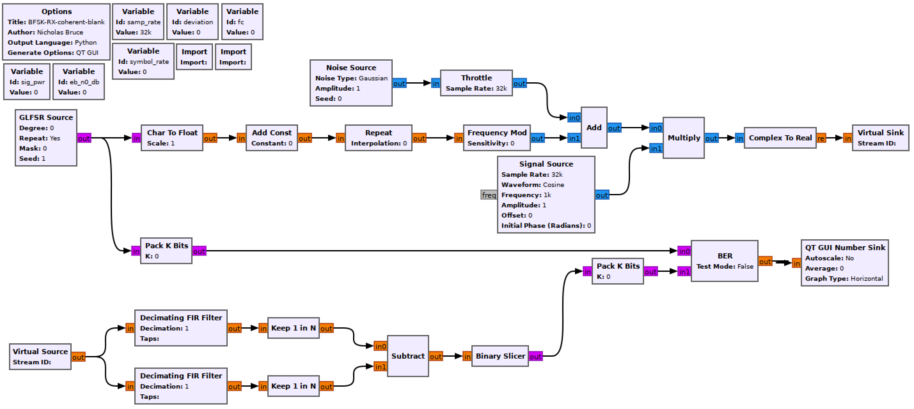
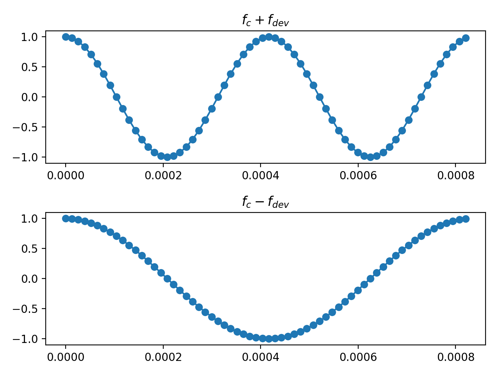
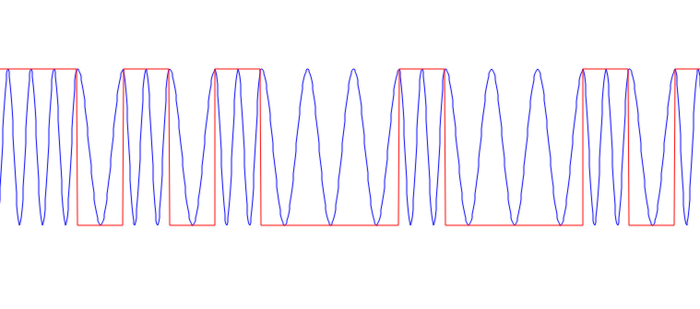
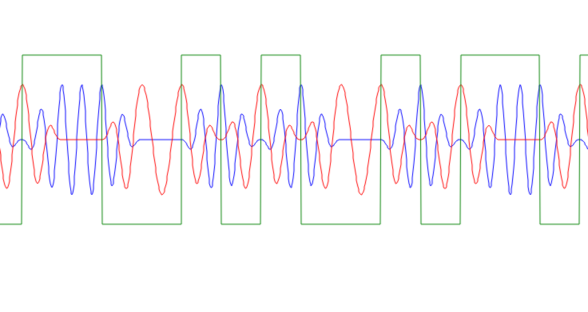
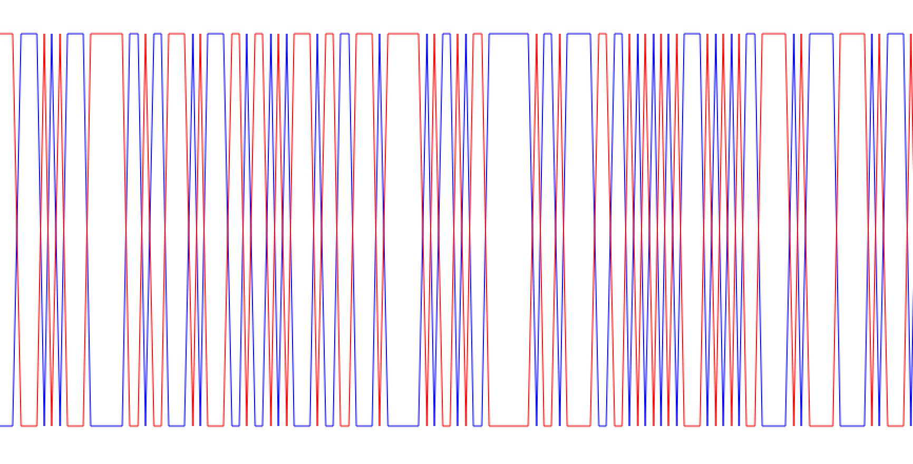

## Objectives

You will implement a coherent real passband FSK receiver to demodulate the transmitting signal chain previously built.

---

## Part 4 deliverables

For this section, the deliverables are:

- the answers to two deliverable questions,
- a dataset for later use in this lab.

---

## Building the flowgraph

Construct the following GRC flowgraph. You can make a copy of the modulating flowgraph from the last section as a starting point by "Save As"-ing it.

  <br>
  __*Coherent BFSK simulation flowgraph.*__

### Variables

Add a *Variable* block called `fc` set to 1800. This will be the center frequency of the transmitted real signal.

Set $$f_s$$ to 76800 Hz. Keep $$f_{sym}$$ at 1200 Hz and $$f_{dev}$$ at $$\frac{f_{sym}}{2}$$.

### Import

Use a second *Import* block to import [NumPy](https://numpy.org/), a common scientific computing package for Python. Import it using the following expression.

```python
import numpy as np
```

This syntax allows you to use the the package functions by calling `np.package_name` instead of typing out `numpy.package_name`.

### Modulator

The modulator is the same as in the previous section with the addition of a complex multiplier to raise the baseband signal to a passband BFSK signal centered around `fc`. The real part of the signal is then taken and transmitted.

### Noise Source

The amplitude (standard deviation) of the noise source is very close to the same as before but with a factor of 0.5 multiplied in.

$$
\begin{align}
\frac{E_b}{N_0} &= \frac{a_i^2}{\sigma_0^2}\frac{W}{R} = \frac{a_i^2}{\sigma_0^2}\frac{f_s}{f_{sym}} \text{(Complex baseband)} \\
\frac{E_b}{N_0} &= \frac{a_i^2}{\sigma_0^2}\frac{W}{R} = \frac{1}{2}\frac{a_i^2}{\sigma_0^2}\frac{f_s}{f_{sym}} \text{(Real passband)} \\
\end{align}
$$



Set the amplitude parameter to the following expression.

```python
math.sqrt( sig_pwr/ (10**(eb_n0_db/10)) * samp_rate/symbol_rate * 1/2 )
```

This is the same expression as from the above theory but where $$\frac{E_b}{N_0}$$ is in units of dB.

### Receiver chain

This is a coherent receiver which is built based on Sklar text section 4.4.4.

### Decimating FIR Filter

Each of these is a matched filter for a single symbol period of one of the two passband frequencies, $$f_c \pm f_dev$$.

Set the taps in the upper path to the following expression.

```python
np.cos(2*np.pi*(fc+deviation)*np.arange(0, symbol_rate**-1, samp_rate**-1))
```

Set the taps in the lower path to the following expression.

```python
np.cos(2*np.pi*(fc-deviation)*np.arange(0, symbol_rate**-1, samp_rate**-1))
```

The expressions are plotted below.

  <br>
  __*Taps for the two matched filters.*__

### Multiply Const

Following the theory in Sklar text section 4.4.4, the waveform can be normalized by the factor $$\sqrt{\frac{2}{T}}$$. Implement this factor using the available variables (it will be one over this number).

### Keep 1 in N

Use these blocks to sample the output of the matched filters on the peaks of the waveform. The argument is the decimation rate. This also decimates the sample rate down to the GLFSR rate of one-sample-per-symbol.

### Binary Slicer

This block outputs a 0 for every negative input and a 1 for every positive output.

### Pack K Bits

Set *K* to 8. This is the packet byte size that the later *BER* block requires.

### BER

This computes the error between the two inputs. It outputs to log of the BER, so if it outputs a value of -2, the BER is $$10^{-2}=0.01$$.

Set *Test Mode* to False, which will mean the block immediately starts outputting results (as opposed to waiting for the error rate to stabilize first). While *Test Mode* is False, the other parameters don't do anything, so you can leave them as they are.

### QT GUI Number Sink

This will draw the output of the BER block on a number line. Set the maximum to 0 (since $$10^0=1$$ meaning that every bit is wrong) and the minumum to -7.

## Analysing the receiver

To understand the demodulation it is important to view the waveform at various steps. First observe the transmitted waveform.

- Place a *QT GUI Time Sink* with 2 "Float" inputs near the end of the receiver chain. Connect the outputs of the *Repeat* and *Complex To Real* blocks to the sink.
- Put a `0*` in front of the *Noise Source*'s expression for $$\sigma$$ so that there is no noise in the waveform.
- Run the flowgraph and observe.

  <br>
  __*Transmitted passband waveform.*__

The two distinct frequencies (1200 Hz and 2400 Hz) can seen clearly. One correlates with an input bit of -1 while the other correlates with an input bit of 1. When a single 1 or -1 is transmitted the waveform matches the taps which were [shown earlier](#decimating-fir-filter). When the bit repeats (`[1, 1, 1, ...]` or `[-1, -1, -1, ...]`) the waveform continues at that frequency until the bit value changes.

Now observe various stages of the receiver.

- Increase the number of inputs to the *QT GUI Time Sink* to 3. Connect the outputs of the two matched filters as well as the output of the *Repeat* block.

  <br>
  __*Output of the matched filters.*__

Notice the delay caused by the FIR filters between the filter outputs and the square waveform. It can be removed by delaying the square waveform at the input of the Sink by the number of filter taps ($$M$$, where this is an M-sample-per-symbol square wave). More importantly, notice that the waveforms coming out of the matched filter flip. One exists while the other is zero. It is no stretch to imagine these as 1's and 0's (amplitude "ons" and amplitude "offs").

Disable the *QT GUI Time Sink* and add a new one with 1 "Float" inputs. View the outputs of the *Keep 1-in-N* blocks. These blocks sample the waveform peaks.

  <br>
  __*Decimated output of the matched filters.*__

Notice that in this noiseless system, the two signals are redundant. The same performance would be obtained by only observing the output of a single matched filter.



Disable all of the *QT GUI Time Sink* blocks. Remove the `0*` from the *Noise Source* $$\sigma$$ parmeter.

## Run the experiment

1. Run the flowgraph.
2. Record the BER at $$\frac{E_b}{N_0}$$ values of `[0, 2, 4, 6, 8, 10]`. You will need to kill the flowgraph each time you need to set a new value.
   - Plotting GUI sink values also eats computational power. While waiting for the BER values to stabilize you may wish to disable any unneeded QT GUI blocks.

At this point you should have recorded 6 BER values.

Review the [section deliverables](#part-4-deliverables) before moving on.
