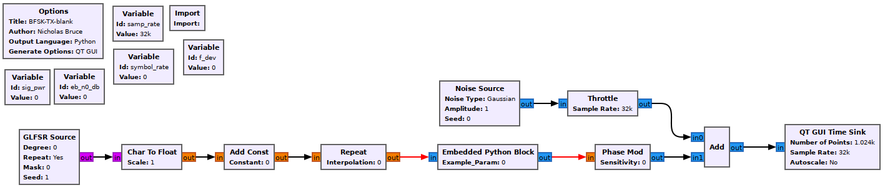
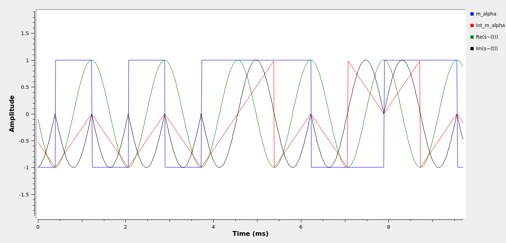

## Objectives

You will build and study a complex baseband FSK modulator.

---

## Part 2 deliverables

For this section, the deliverables are:

- the answer to two deliverable questions,
- a flowgraph to resuse later in the lab.

---

## Building the flowgraph

Construct the following GRC flowgraph.

  <br>
  __*Blank BFSK modulator flowgraph*__

### Variables

- The `samp_rate` of this flowgraph is 76.8 kHz and the `symbol_rate` is 1200 Hz.
- Set the `deviation` variable appropriately (review the [theory section]({{ site.baseurl }}) if needed).
- Leave the other variables set to 0 for now.

### Import

Import the math library with `import math`.

### GLFSR Source

This block outputs a pseudo-random bit stream using a shift register as described in the [theory section of Lab 1]({{ site.baseurl }}). Set the Degree of the shift register to 20 (this is the LFSR's $$M$$ value). Set it to repeat.

### Char To Float & Add Const

The output of the GLFSR block is a series of 1's and 0's. In order to build a bipolar signal the 0s must become -1s. This can be done using the following equation

$$
y[n] = 2x[n]-1
$$

where $$y[n]$$ is the output stream made up of -1s and 1s and $$x[n]$$ is the input stream of 0s and 1s.

Setting the *Scale* parameter of the *Char To Float* block to 0.5 and the *Constant* parameter of the *Add Const* block to -1. You can observe the output of the *Add Const* block using a *QT GUI Constellation Sink* to see that this is now a bipolar signal.

### Repeat

Now use the repeat block to turn the 1-sample-per-symbol signal into an M-sample-per-symbol square pulse-shaped signal. Use the `samp_rate` and `symbol_rate` variables.

### Embedded Python Block

This block allows you to create a custom block by writing some Python and embedding it in the flowgraph. Recalling the expression for a sampled complex baseband BFSK signal, the output of the *Repeat* block is $$m(\alpha)$$. This *Embedded Python Block* will be made into a cumculative sum block so that the output of the block is the integral, $$\int_0^t m(\alpha)d\alpha$$.

Open the block and click "Open in Editor". You will now be able to edit the Python that processes the input. The code already filling the block takes the input and multiplies it by a constant, delivering the product as the blocks output. First look at the constructor (`__def init()`). It takes an argument and a default value for it, `example_param=1.0`. Anything added here becomes a parameter of the block which can be easily adjusted from the normal block parameters GUI. Since the cumulative sum requires no input paramters, remove the argument.

A few lines lower is the name of the block, `name='Embedded Python Block'`. You can change it to something more meaningful, like `CumSum` so that the flowgraph is easy to interpret. The next two lines indicate the input and output signal types. The default is `np.complex64`. Looking back at the flowgraph you can see that the necessary datatype is a float (`np.float`) so change them appropriately.

The callback slightly lower is for the example paramter and it can be removed since the `example_param` argument no longer exists. We will now add a variable to store the cumulative sum. Add the following line where the callback used to be.

```python
self.cumsum = [0.0]
```

Now the `work()` function must be changed. Reading through it now shows the multiplication with the example parameter. Remove this and replace it with the following:

```python
for i in np.arange(len(output_items[0])):
  self.cumsum += input_items[0][i]
  out_items[0][i] = self.cumsum

return len(output_items[0])
```

The input to the block is delivered in chunks of samples (the size of the chunk depends on a number of factors including OS and available hardware, but is generally around 8192 samples). This code block will take the input, add every input to the existing cumulative sum and put it in the output buffer. The complete code snippet should look like the following.

```python
"""
Embedded Python Blocks:

Each time this file is saved, GRC will instantiate the first class it finds
to get ports and parameters of your block. The arguments to __init__  will
be the parameters. All of them are required to have default values!
"""

import numpy as np
from gnuradio import gr


class blk(gr.sync_block):
    """Embedded Python Block - Cumulative Sum"""

    def __init__(self):
        gr.sync_block.__init__(
            self,
            name='CumSum',       # will show up in GRC
            in_sig=[np.float32], # input datatype
            out_sig=[np.float32] # output datatype
        )
        self.cumsum = [0.0]


    def work(self, input_items, output_items):
        in_arr = input_items[0]
        out_arr = output_items[0]

        for i in np.arange(len(output_items[0])):
            self.cumsum += input_items[0][i]
            output_items[0][i] = self.cumsum

        return len(output_items[0])

```

Save your changes and exit back to the flowgraph.

### Phase Mod

It is helpful to see the [Phase Mod documentation](https://wiki.gnuradio.org/index.php/Phase_Mod). This block has one parameter, *Sensitivity* and the output is $$e^{j*sensitivity*input}$$. Recall from the theory section that

$$
\tilde{s}(t) = e^{\frac{j2\pi f_{dev}}{f_s} \int^t_0 m(\alpha)d\alpha}.
$$

Set the *Sensitivity* of the block to `2*math.pi*deviation/samp_rate` so that the output of the block is $$\tilde{s}(t)$$.

### Noise Source

For now leave it with default parameters.

## Run the experiment

1. Add a *QT GUI Time Sink* to the flowgraph. Set the *Type* to *Float* and the *Number of Inputs* to 4. You can use the *Config* tab to label the 4 inputs as `m_alpha`, `int_m_alpha`, `Re(s~(t))` and `Im(s~(t))`. Connect the respective inputs to the output of the *Repeat*, *CumSum*, and *Phase Mod* blocks (you'll need a *Complex To Float* block to connect the output of the *Phase Mod*).
   - Don't forget to activate the the Control Panel in the block!
   - The ramp coming out of the *CumSum* block will rise and fall by much greater than the maximum value of 1 (as shown in the [theory section of this lab]({{ site.baseurl }}) that the other outputs have. To "wrap" the ramp (much like phase wrapping), add another *Python Block* in between the output of the *CumSum* block and the input of the *QT GUI Time Sink* block. This is done solely to keep the phase ramp within easy-to-read bounds that match the limits of the waveform amplitude. Replace the code in the block with the following segment

     ```python
     import numpy as np
     from gnuradio import gr


     class blk(gr.sync_block):
       """Embedded Python Block that wraps the input given some bounds"""

       def __init__(self, sample_rate=0.0, symbol_rate=0.0, low=-1.0, high=1.0):  # only default arguments here
           """arguments to this function show up as parameters in GRC"""
           gr.sync_block.__init__(
               self,
               name='Wrap',
               in_sig=[np.float32],
               out_sig=[np.float32]
           )
           # callbacks
           self.samp_rate = sample_rate
           self.symbol_rate = symbol_rate
           self.low = low
           self.high = high

       def bound(self, value):
           """Wraps and normalizes input"""
           value = value/(self.samp_rate/self.symbol_rate)
           diff = self.high-self.low
           return (((value-self.low) % diff) + self.low)

       def work(self, input_items, output_items):
           for i in np.arange(len(output_items[0])):
               output_items[0][i] = self.bound(input_items[0][i])

           return len(output_items[0])
     ```

2. Run the flowgraph. Stop it soon after starting so that the plot freezes. You should see a figure like the following
  <br>
  __*$$m(\alpha), \int_0^t m(\alpha) d\alpha, \mathbb{Re}\left\{\tilde{s}(t)\right\}, \mathbb{Im}\left\{\tilde{s}(t)\right\}$$ plotted together in GNU Radio.*__

3. If you wish to see the signal at passband, multiply the signal coming out of the *Phase Mod* block with a complex cosine with a frequency of 1500 Hz.





Review the [section deliverables](#part-2-deliverables) before moving on.
