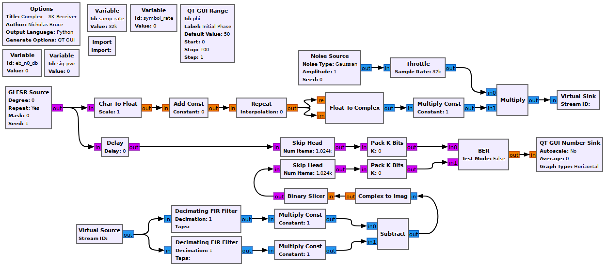

## Objectives

You will implement a coherent BPSK receiver to demodulate the transmitting signal chain built in the previous lab section.

---

## Part 3 deliverables

For this section, the deliverables are:

- the answer to one deliverable question,
- a dataset for later use in this lab.

---

## Building the flowgraph

Construct the following GRC flowgraph. You can make a copy of the modulating flowgraph from the last section as a starting point by "Save As"-ing it.

  <br>
  __*Complex coherent BPSK receiver flowgraph*__

### Modulator

Keep the variables and the rest of the modulation chain unchanged.

Notice that since the M-sample-per-symbol bitstream is used for _both_ the real and the imaginary components of the complex stream, the `sig_pwr` value is 2. This can be confirmed with the a *Complex To Mag^2* -> *Moving Average* -> *QT GUI Number Sink* chain from previous labs.

### Noise Source

Remember from previous labs that the *Amplitude* variable sets the noise standard deviation, $$\sigma$$. Use the following expression to set $$\sigma$$ using the `eb_n0_db` variable.

```python
np.sqrt( sig_pwr/ (10**(eb_n0_db/10)) * samp_rate/symbol_rate )
```

This is the same expression as from the [theory section of the previous lab]({{ site.baseurl }}) but where $$\frac{E_b}{N_0}$$ is in units of dB.

### Receiver chain

This is a coherent receiver which relies on correlating the waveform with taps for a BPSK "+1" (data 1) and "-1" (data 0) and seeing which has a stronger correlation.

### Decimating FIR Filter

These blocks will do the correlations against provided taps as well as decimate from M-sample-per-symbol down to 1-sample-per symbol. Set the taps of the upper chain to

```python
np.ones((samp_rate//symbol_rate))+ 1j*np.ones((samp_rate//symbol_rate))
```

and the taps of the lower chain to

```python
-np.ones((samp_rate//symbol_rate)) - 1j*np.ones((samp_rate//symbol_rate))
```

These taps will match an M-sample-per-symbol complex baseband "1" and "0" respectively. Set the decimation rate to `samp_rate//symbol_rate` to match the *Repeat* block from earlier.



### Multiply Const

While not strictly necessary since the correlation output is going through a binary slicer, scaling the correlation output by $$\sqrt{2T}$$ will put the output of the correlator to $$\sqrt{E}$$ to match the theory in Sklar text section 4.4.1.

Set the argument to `1/np.sqrt(2*symbol_rate)`.

### Binary Slicer

This block outputs a 0 for every negative input and a 1 for every positive output.

### Delay

The *Decimating FIR Filter* causes a delay on the receiver signal chain. Use a 1 sample delay to align the signals.

### Skip Head

Because of the filter, even once delayed the BER will take time to stabilize. This can be avoided by skipping the first part of each waveform before measuring the BER. Set the argument to 2048.

### Pack K Bits

Set *K* to 8. This is the packet byte size that the later *BER* block requires.

### BER

This computes the error between the two inputs. It outputs to log of the BER, so if it outputs a value of -2, the BER is $$10^{-2}=0.01$$.

Set *Test Mode* to False, which will mean the block immediately starts outputting results (as opposed to waiting for the error rate to stabilize first). While *Test Mode* is False, the other parameters don't do anything, so you can leave them as they are.

### QT GUI Number Sink

This will draw the output of the BER block on a number line. Set the maximum to 0 (since $$10^0=1$$ meaning that every bit is wrong) and the minumum to -7.

## Run the experiment

1. Run the flowgraph.
2. Record the BER at $$\frac{E_b}{N_0}$$ values of `[0, 2, 4, 6, 8]`. You will need to kill the flowgraph each time you need to set a new value.
   - Plotting GUI sink values also eats computational power. While waiting for the BER values to stabilize you may wish to disable any unneeded QT GUI blocks.
3. Put a `0*` in front of the *Noise Amplitude* argument. Restart the flowgraph and confirm that the BER is 0 (meaning no bit errors). Now change $$\phi$$ by a very small amount. Observe the BER rising.
4. Set $$\phi$$ back to 0 and change $$f_c$$ by a small amount. Observe the BER rising.

At this point you should have recorded 5 BER values.



Review the [section deliverables](#part-3-deliverables) before moving on.
