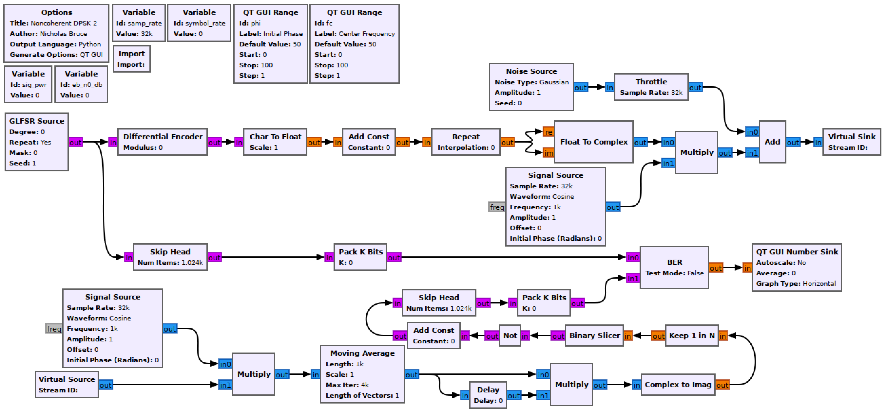

## Objectives

You will implement another complex noncoherent baseband DPSK receiver.

---

## Part 5 deliverables

For this section, the deliverables are:

- the answers to two deliverable questions,
- a dataset for later use in this lab.

---

## Building the flowgraph

Construct the following GRC flowgraph. You can make a copy of the modulating flowgraph from the last section as a starting point by "Save As"-ing it.

   
  __*Noncoherent DPSK simulation flowgraph.*__

This is an implementation from Sklar text section 4.5.2 (below)

   
  __*Noncoherent DPSK demodulator (Sklar fig. 4.17c).*__

### Modulator

The modulator is unchanged.

### Signal Source

The receiver signal source shifts the passband waveform down to baseband so set the *Frequency* parameter to `-fc`. Since this is a noncoherent receiver the initial phase of the reference signal does not matter.

### Moving Average

Use the moving average to integrate over a symbol period. This will be a function of the sample rate and the symbol rate. Set the *Scale* parameter to the inverse of this value.

### Delay

To match the theory block diagram above, delay the bitstream by a symbol period then multiply with it's undelayed self.

### Keep 1 in N

Bring the waveform from M-samples-per-symbol back down to 1 sample-per-symbol by setting this using a function of sample rate and symbol rate.

### Not and Add Const

These blocks will invert the binary bitstream when used together. Set the *Constant* parameter to 2.

### Skip Head

Because of the filter, even once delayed the BER will take time to stabilize. This can be avoided by skipping the first part of each waveform before measuring the BER. Set the argument to 2048.

### Pack K Bits

Set *K* to 8. This is the packet byte size that the later *BER* block requires.

### BER

This computes the error between the two inputs. It outputs to log of the BER, so if it outputs a value of -2, the BER is $$10^{-2}=0.01$$.

Set *Test Mode* to False, which will mean the block immediately starts outputting results (as opposed to waiting for the error rate to stabilize first). While *Test Mode* is False, the other parameters don't do anything, so you can leave them as they are.

### QT GUI Number Sink

This will draw the output of the BER block on a number line. Set the maximum to 0 (since $$10^0=1$$ meaning that every bit is wrong) and the minumum to -7.

## Run the experiment

1. Run the flowgraph.
2. Record the BER at $$\frac{E_b}{N_0}$$ values of `[0, 2, 4, 6, 8]`. You will need to kill the flowgraph each time you need to set a new value.
   - Plotting GUI sink values also eats computational power. While waiting for the BER values to stabilize you may wish to disable any unneeded QT GUI blocks.
3. Add a *QT GUI Time Sink* with two "Float" inputs. Use two *Char To Float* blocks to plot the outputs of the *Skip Head* blocks. Also add a *QT GUI Constellation Sink* at the end of the modulation chain to observe the transmitted constellation.
4. Change $$\phi$$ slowly and see that while the waveform changes, the BER value does not. This is a noncoherent receiver.

5. Put a `0*` in front of the *Amplitude* parameter of the *Noise Source* block. Slowly increase $$f_c$$ and while observing the receiver and transmitted bitstreams. Check whether this receiver is more or less offset-resilient than the previous DPSK receiver.



At this point you should have recorded 5 BER values.

Review the [section deliverables](#part-5-deliverables) before moving on.
