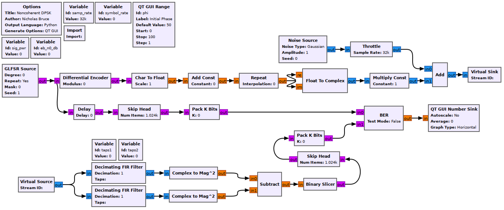

## Objectives

You will implement a complex noncoherent baseband DPSK receiver.

---

## Part 4 deliverables

For this section, the deliverables are:

- the answers to one deliverable questions,
- a dataset for later use in this lab.

---

## Building the flowgraph

Construct the following GRC flowgraph. You can make a copy of the modulating flowgraph from the last section as a starting point by "Save As"-ing it.

  <br>
  __*Noncoherent DPSK simulation flowgraph.*__

### Modulator

The modulator is largely unchanged excepting the addition of a *Differential Decoder*. The "Modulus" parameter is to indicate the size of the alphabet the stream is to be differentially encoded into. Set it to 2 so that the bitstream remains binary.

### Variables

Add two new variables with the names `taps1` and `taps2`. `taps1` should be set to

```python
np.ones((samp_rate//symbol_rate)) + 1j*np.ones((samp_rate//symbol_rate))
```

while `taps2` should be set to `-taps1`. Each of these is $$1T$$ of the modulated bitstream.

### Decimating FIR Filter

Each of these is a matched filter for a two symbol periods. The filter will also decimate from M-samples-per-symbol to 1-sample-per-symbol. The upper is taps for `[1, -1]` and so should be set to

```python
np.concatenate((taps1, taps2)).
```

The lower is taps for `[1, 1]` and so should be set to

```python
np.concatenate((taps1, taps1)).
```

Ensure the "Decimation" paramter is set appropriately to bring the signal down to 1-sample-per-symbol.

### Complex To Mag^2

These blocks take the envelope of the signal.

### Binary Slicer

This block outputs a 0 for every negative input and a 1 for every positive output.

### Delay

The *Decimating FIR Filter* causes a delay on the receiver signal chain. Use a 1 sample delay to align the signals.

### Skip Head

Because of the filter, even once delayed the BER will take time to stabilize. This can be avoided by skipping the first part of each waveform before measuring the BER. Set the argument to 2048.

### Pack K Bits

Set *K* to 8. This is the packet byte size that the later *BER* block requires.

### BER

This computes the error between the two inputs. It outputs to log of the BER, so if it outputs a value of -2, the BER is $$10^{-2}=0.01$$.

Set *Test Mode* to False, which will mean the block immediately starts outputting results (as opposed to waiting for the error rate to stabilize first). While *Test Mode* is False, the other parameters don't do anything, so you can leave them as they are.

### QT GUI Number Sink

This will draw the output of the BER block on a number line. Set the maximum to 0 (since $$10^0=1$$ meaning that every bit is wrong) and the minumum to -7.

## Run the experiment

1. Run the flowgraph.
2. Record the BER at $$\frac{E_b}{N_0}$$ values of `[0, 2, 4, 6, 8]`. You will need to kill the flowgraph each time you need to set a new value.
   - Plotting GUI sink values also eats computational power. While waiting for the BER values to stabilize you may wish to disable any unneeded QT GUI blocks.
3. Change $$\phi$$ as you go and see that it has no impact on the BER value.



At this point you should have recorded 5 BER values.

Review the [section deliverables](#part-4-deliverables) before moving on.
