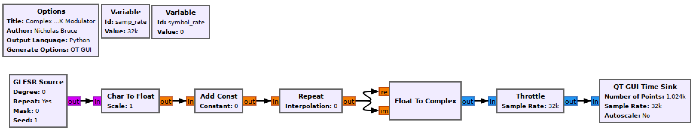
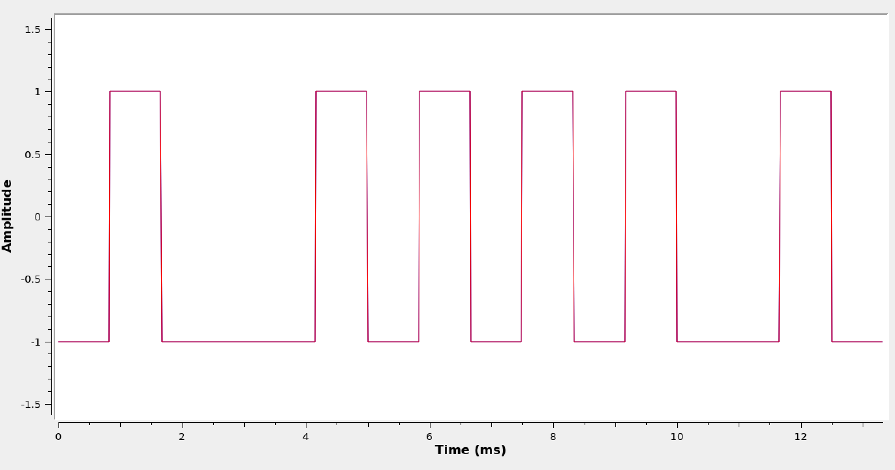
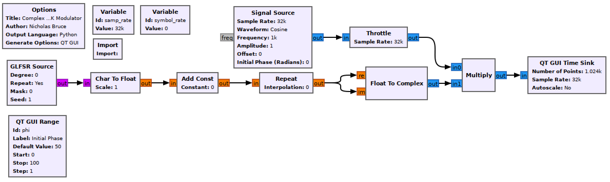
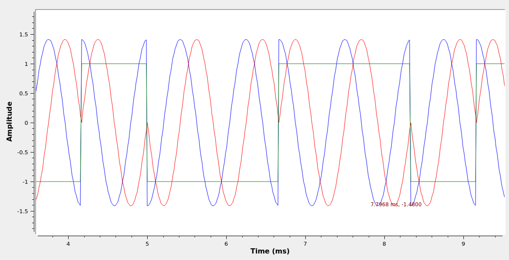

## Objectives

You will build and study a complex baseband BPSK modulator as well as a real passband BPSK modulator.

---

## Part 2 deliverables

For this section, the deliverables are:

- the answer to one deliverable question,
- a flowgraph to reuse later in the lab.

---

## Building the baseband flowgraph

Construct the following GRC flowgraph.

   
  __*Blank complex baseband BPSK modulator flowgraph*__

### Variables

- The `samp_rate` of this flowgraph is 76.8 kHz and the `symbol_rate` is 1200 Hz.

### Transmitter chain

Use the blocks in the above figure to create an M-sample-per-symbol complex BB BPSK signal. The signal should have peaks of 1 and -1, be pseudo-random, and the scope should show an output like the below figure (which matches the [theory section of the lab]({{ site.baseurl }})).

   
  __*Complex baseband BPSK waveform.*__

## Building the passband flowgraph

Saving the baseband flowgraph as a new file, create a complex passband BPSK modulator flowgraph as below.

   
  __*Blank complex passband BPSK modulator flowgraph*__

### Variables and Import

The sample and symbol rates are unchanged. Use the *Import* block to `import numpy as np`. Now all of the [NumPy](https://numpy.org/) tools can be used.

### QT GUI Range

The first will be used to set the initial phase of the carrier frequency. Set the *Id* to `phi`. The initial value should be 0 and the range should go from `-np.pi` to `np.pi` in small steps (use your best judgement).

The second will be used to cause a frequency offset from baseband (by having a carrier frequency) later in the lab. Set the *Id* to `fc`. The initial value should be 0 and the range should go from 0 to `2*symbol_rate`.

### Signal Source

This block multiplies in a carrier frequency. Set the *Frequency* to `fc` and the *Initial Phase* to `phi`.

{% include alert.html title="Note" content="In GR v3.7 and below there is no *Initial Phase* parameter. There is a simple work around. We know that the carrier frequency signal being built is $$e^{j\left( 2\pi f_c t + \phi \right)}$$. In GR v3.8 the *Signal Source* generates this. In GR v3.7 the *Signal Source* only generates $$e^{j 2\pi f_c t}$$. However $$e^{j\left( 2\pi f_c t + \phi \right)}=e^{j 2\pi f_c t}e^{j\phi}$$. If you are running GR v3.7 place a *Multipy Const* block after the *Signal Source* and set the value to $$e^{j\phi}$$ using `np.exp(1j*phi)`." %}

## Run the experiment

1. Run the flowgraph and observe the waveform. Set the frequency offset to 1200. Since the carrier frequency is now equal to the symbol rate the flowgraph, there should be one period of the sine/cosine contained in each symbol.
2. Change the *QT GUI Time Sink* to be *Type* "Float" and to have 3 inputs. Use a *Complex To Float* block at the output of the *Mutiply* block. The three inputs to the time sink are then $$\mathbb{Re}\{s(t)\}$$, $$\mathbb{Im}\{s(t)\}$$, and the M-sample-per-symbol bitstream. Observe the passband waveform as you change $$\phi$$ and $$\delta f$$.

   
  __*Complex passband BPSK waveform ($$\phi=-\frac{\pi}{4}, f_c=1200 \text{ Hz}$$).*__

{:start="3"}
3. Set the frequency offset back to 0. Observe the waveform while changing $$\phi$$.



Review the [section deliverables](#part-2-deliverables) before moving on.
